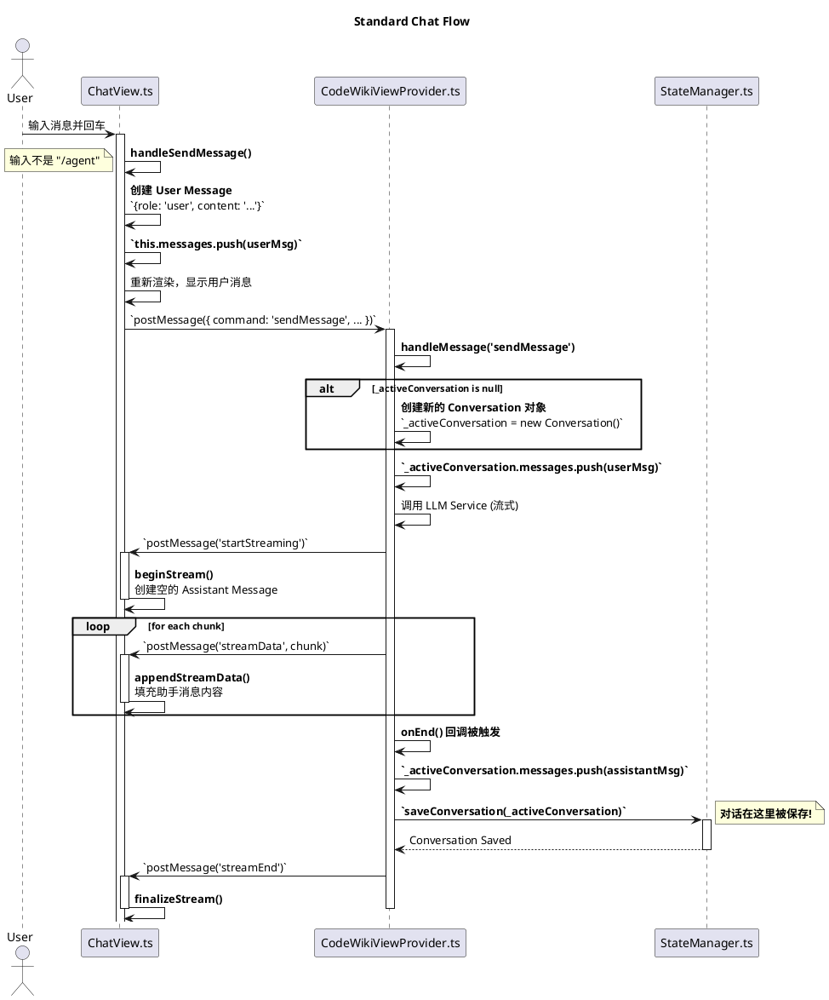
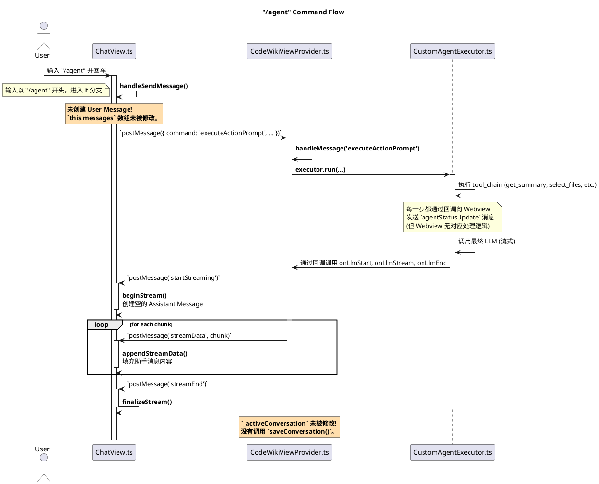

## 详细设计文档 v2.2：将 LLM 调用封装为工具 (LLM-as-a-Tool)

### 1. 概述 (Overview)

在 v2.0 的基础上，我们扩展 `tool_chain` 的能力，使其不仅能调用确定的本地函数（如文件操作），还能**调用另一个大语言模型（LLM）来完成一个中间步骤**。这个“子LLM调用”被封装成一个标准的 LangChain `Tool`，使其可以被我们的 `CustomAgentExecutor` 无缝地调用。

这个模式允许我们构建更复杂的、多阶段的推理链。例如，在生成文档前，先让一个“筛选模型”从大量文件中找出最核心的几个，从而降低最终“文档生成模型”的上下文压力和成本，并提高相关性。

### 2. 核心概念与架构设计

#### 2.1 新的动作提示词 (Action Prompt) 结构

我们的 YAML 结构需要支持调用这种新的 "LLM Tool"。

**扩展后的 YAML 结构示例：**

```yaml
title: "生成核心模块设计文档 (智能筛选版)"
description: "智能分析模块内的所有文件，找出核心文件，并基于它们生成技术文档。"

input_variables:
  - name: module_path
    description: "请输入或选择要分析的模块/文件夹路径。"
    type: "path"
  - name: task_description
    description: "简要描述你想分析的核心任务是什么？"
    type: "text"
    default: "这个模块的核心功能是处理大模型请求和管理插件状态。"

tool_chain:
  # 步骤 1: 获取所有文件的路径和内容摘要（不是全部内容，避免过载）
  - tool: "get_file_summaries"
    input: "{module_path}"
    output_variable: all_file_summaries
    
  # 步骤 2: **调用 LLM 作为工具，进行智能筛选**
  - tool: "file_selector_llm_tool"
    # 这个工具的输入是上一步的输出和用户输入的任务描述
    input: 
      file_summaries: "{all_file_summaries}"
      task_description: "{task_description}"
    output_variable: selected_files_list

  # 步骤 3: 根据筛选出的文件列表，获取它们的完整内容
  - tool: "get_files_content_by_list"
    input: "{selected_files_list}"
    output_variable: selected_files_content

# 最终提交给文档生成 LLM 的提示词模板
llm_prompt_template:
  system: |
    你是一个经验丰富的软件架构师...
  human: |
    请根据以下精心筛选出的核心文件，为模块生成一份详细设计文档。

    **核心文件内容：**
    {selected_files_content}

    **详细设计文档结构：**
    ... (省略) ...
```

#### 2.2 架构修改

*   **`CustomAgentExecutor`**: 保持不变。它的设计本身就是通用的，只要是 `Tool` 就能调用，不关心 `Tool` 内部是文件操作还是 LLM 调用。
*   **新增工具**: 我们需要定义新的本地文件工具和 LLM 工具。

### 3. 详细设计

#### 3.1 后端 (Extension) 设计

1.  **扩展的 LangChain 工具集 (`src/extension/tools/`)**

    *   **`fileSystemTools.ts` (修改与新增)**
        *   `GetFileSummariesTool`: 一个新工具。
            *   `name`: `get_file_summaries`
            *   `description`: "获取指定路径下所有文件的路径和代码摘要（如前N行或函数签名）。"
            *   `schema`: `zod.object({ path: z.string() })`
            *   `_call({ path })`: 实现获取文件摘要的逻辑。这比读取全部内容更高效。
        *   `GetFilesContentByListTool`: 一个新工具。
            *   `name`: `get_files_content_by_list`
            *   `description`: "根据提供的文件路径列表，获取这些文件的完整内容。"
            *   `schema`: `zod.object({ file_paths: z.array(z.string()) })`
            *   `_call({ file_paths })`: 循环读取列表中的每个文件并返回拼接后的内容。

    *   **`llmTools.ts` (新增文件)**
        *   在这里，我们将定义一个或多个“LLM 即工具”。
        *   `createFileSelectorLLMTool(llm: BaseLanguageModel): StructuredTool`
            *   这是一个工厂函数，它接收一个 LLM 实例，返回一个配置好的 `Tool`。这样做的好处是可以复用插件中已有的 LLM 配置。
            *   **Tool 定义**:
                *   `name`: `file_selector_llm_tool`
                *   `description`: "根据文件摘要和任务描述，从文件列表中筛选出最相关的核心文件。"
                *   `schema`: `zod.object({ file_summaries: z.string(), task_description: z.string() })`
                *   `_call({ file_summaries, task_description })`: **这是核心实现**。
                    1.  **构建子提示 (Sub-Prompt)**: 创建一个新的、专门用于文件筛选的 `ChatPromptTemplate`。
                        ```javascript
                        const selectionPrompt = ChatPromptTemplate.fromMessages([
                          ["system", "你是一个智能代码分析助手。你的任务是根据用户提供的任务描述和文件摘要列表，选出与任务最相关的核心文件。请只返回一个用逗号分隔的文件路径列表，不要添加任何其他解释。"],
                          ["human", "任务描述：{task_description}\n\n文件列表和摘要：\n{file_summaries}\n\n请返回最核心的文件路径列表："]
                        ]);
                        ```
                    2.  **构建子链 (Sub-Chain)**: 将这个提示模板和传入的 `llm` 实例连接起来。
                        ```javascript
                        const selectionChain = selectionPrompt.pipe(llm).pipe(new StringOutputParser());
                        ```
                    3.  **调用子链**:
                        ```javascript
                        const result = await selectionChain.invoke({ file_summaries, task_description });
                        ```
                    4.  **解析和返回**: 将 `result` (一个字符串，如 `"src/a.ts,src/b.ts"`) 解析成一个字符串数组并返回。这个数组将成为此工具的最终输出。

2.  **`CodeWikiViewProvider.ts` 的修改**
    *   在初始化时，需要创建所有工具的实例，包括调用 `createFileSelectorLLMTool()` 来创建 LLM 工具。
    *   将所有工具实例传递给 `CustomAgentExecutor`。
    *   其余逻辑（如 `executeActionPrompt` 消息处理）**无需任何改变**，因为 `CustomAgentExecutor` 的接口是统一的。

#### 3.2 前端 (Webview) 设计

*   **无需重大修改**。前端的设计已经支持动态渲染 `input_variables`。对于新的 YAML 模板，它会自然地渲染出 `module_path` 和 `task_description` 两个输入框。
*   用户的交互流程也保持一致：选择提示词 -> 填写新出现的两个参数 -> 点击 `Execute`。
*   执行过程的实时反馈机制也完全兼容，因为它只关心 `onToolStart` 和 `onToolEnd` 事件，不关心工具内部做了什么。当 `file_selector_llm_tool` 执行时，前端会显示：
    ```
    - 正在执行: 智能筛选核心文件...
    ```

### 4. 总结与优势

通过将 LLM 调用本身封装成一个 `Tool`，我们获得了巨大的灵活性和强大的能力：

1.  **关注点分离 (Separation of Concerns)**:
    *   **主 LLM**: 负责最终的、创造性的任务（如生成文档）。
    *   **工具 LLM**: 负责逻辑性、分析性的中间任务（如筛选、分类、提取数据）。这通常可以使用更小、更快的模型来完成，从而优化成本和速度。

2.  **可组合性 (Composability)**:
    *   你可以创建一系列的 "LLM Tools"，例如 `summarizer_llm_tool`, `code_translator_llm_tool`, `test_case_generator_llm_tool` 等。
    *   用户（或插件开发者）可以在 YAML 中像乐高积木一样自由组合这些工具和本地工具，构建出无限复杂的自动化工作流，而无需修改核心的 Executor 代码。

3.  **遵循 LangChain 范式**:
    *   这种 "Chain-of-Thought" 和 "Tool-Using" 的结合，完全符合 LangChain 的核心设计哲学，使得整个架构清晰、标准且易于扩展。


当然，这里使用 PlantUML 流程图来清晰地展示标准对话流程和 `/agent` 流程的差异，并解释为什么用户信息为空以及对话未被保存。

### 1. 标准对话流程 (Standard Chat Flow)

这个流程展示了如何创建用户消息、调用LLM，并最终保存整个对话。



### 2. `/agent` 流程 (`/agent` Command Flow)

这个流程展示了 `/agent` 命令如何绕过标准的对话创建和保存机制。



### 流程图总结

1.  **用户消息的缺失**: 在 `/agent` 流程图中，有一个非常明显的红色备注框指出“未创建 User Message”。这是导致您在界面上看不到用户输入框的直接原因。
2.  **保存操作的缺失**: 同样，在 `/agent` 流程图的后端部分，另一个红色备注框指出“没有调用 `saveConversation()`”。这是导致对话历史中没有记录的直接原因。

这两个流程图清晰地对比了两种路径，直观地展示了 `/agent` 命令是如何“抄近路”执行任务，从而跳过了所有与对话状态持久化相关的关键步骤。