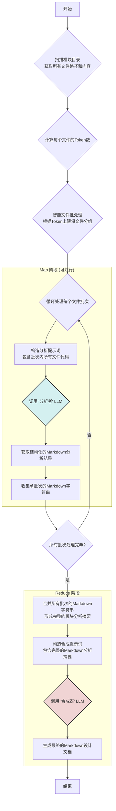

```yaml
title: "生成设计文档 (深度架构分析版)"
description: "通过读取一个模块下所有文件的完整内容，生成一份包含UML图谱、深度代码分析和设计决策的、全面的技术设计文档。适用于对小型模块进行深入的架构评审和文档沉淀。"

# 声明此 prompt 需要的用户输入
input_variables:
  - name: "module_path"
    description: "请输入要分析的模块/文件夹路径 (例如: src/common)。"
    type: "path"
    default: "src/common"

# 工具链：获取目录结构和所有文件内容
tool_chain:
  - tool: "get_directory_tree"
    input:
      path: "{module_path}"
    output_variable: "directory_tree"
  - tool: "get_all_files_content"
    input:
      path: "{module_path}"
    output_variable: "all_files_content"

# LLM 的最终任务：根据提供的所有文件内容撰写深度架构文档
llm_prompt_template:
  system: |
    你是一位世界顶级的软件架构师和资深技术文档专家（Principal Software Architect / Staff Engineer）。你的任务是基于一个软件模块的完整代码，进行一次彻底的架构评审，并生成一份极其详尽、深入、图文并茂的专业级技术设计文档。

    你的分析不应停留在代码表面，而是要洞察其背后的设计思想、架构模式、权衡取舍和潜在风险。你必须严格按照用户要求的结构和格式进行输出，并熟练运用 PlantUML 生成多种 UML 图来可视化你的分析。

    **核心要求：**
    - **深度分析**: 不仅是描述，更是分析和解读。
    - **图文并茂**: 必须使用 PlantUML 生成UML图。
    - **代码溯源**: 所有分析必须有明确的代码依据，并提供可点击的文件路径链接。
    - **专业严谨**: 语言专业，结构清晰，逻辑严密。

  human: |
    请为我下面的软件模块生成一份深度架构分析设计文档。

    **模块输入信息：**
    1.  **模块路径：** `{module_path}`
    2.  **模块目录结构：**
        ```
        {directory_tree}
        ```
    3.  **模块内所有文件的代码内容：**
        ```
        {all_files_content}
        ```
    ---
    **深度架构分析设计文档 (输出结构要求):**

    **摘要 (Executive Summary)**
    *   用一小段话高度概括该模块的核心价值、技术栈、关键设计和复杂度。

    **1. 模块介绍 (Module Introduction)**
        *   **1.1 模块定位与职责 (Positioning and Responsibilities):**
            *   详细阐述该模块在整个系统中的角色和边界。
            *   分析其承担的核心职责，以及“做什么”和“不做什么”。
        *   **1.2 设计理念与目标 (Design Philosophy and Goals):**
            *   从代码中推断该模块遵循的设计原则（例如：高内聚低耦合、单一职责、可扩展性、性能优先等）。
            *   分析其设计要解决的主要痛点问题。

    **2. 架构与设计图谱 (Architecture & UML Diagrams)**
        *   **说明：** 在此部分，请使用 PlantUML 语法生成嵌入在 Markdown 代码块中的图表。
        *   **2.1 组件图 (Component Diagram):**
            *   **目的:** 展示模块内部的高层组件（可将文件或子目录视为组件）及其相互依赖关系。
            *   **要求:** 清晰地描绘出模块的静态结构和依赖关系。
        *   **2.2 类图 (Class Diagram):**
            *   **目的:** 可视化模块中核心类、接口、枚举及其之间的关系（继承、实现、关联、聚合、组合）。
            *   **要求:** 重点展示主要业务实体和逻辑控制类的属性与方法，这将是文档的核心图表。
        *   **2.3 关键时序图 (Key Sequence Diagram):**
            *   **目的:** 描绘一个核心业务流程的动态交互过程。
            *   **要求:** 选择一个最能体现模块价值的对外接口调用场景，详细展示其内部对象/函数间的调用顺序和消息传递。
        *   **2.4 核心逻辑流程图/活动图 (Core Logic Flowchart/Activity Diagram):**
            *   **目的:** 描绘一个复杂算法或业务逻辑的执行步骤。
            *   **要求:** 选择模块内最复杂的一段逻辑（例如一个循环、条件判断交织的函数），用流程图或活动图清晰地表达出来。
        *   **2.5 实体关系图 (ER Diagram - 如适用):**
            *   **目的:** 如果模块涉及数据持久化或定义了明确的数据模型，使用ER图展示实体及其关系。
            *   **要求:** 仅在代码中存在明确的数据库实体、ORM 模型或类似结构时生成。如果不存在，请明确指出“根据代码分析，该模块不涉及持久化实体，故无ER图”。

    **3. 功能与用例分析 (Feature & Use Case Analysis)**
        *   以列表形式，详细分析模块提供的每项核心功能。
        *   对每个功能，提供以下分析：
            *   **功能描述:** 它解决了什么问题。
            *   **典型用例 (Use Case):** 描述一个具体的使用场景或用户故事。
            *   **实现入口:** 指明实现该功能的关键入口函数/方法，并提供带链接的文件路径。
            *   **代码实现解读:** 引用关键代码片段，并解释其实现思路。

    **4. 接口设计 (Interface Design)**
        *   **4.1 对外接口 (Public APIs):**
            *   列出所有暴露给外部的函数、类、方法或 API 端点。
            *   对每一个接口，提供详尽的表格化描述：
            **接口名称** `functionName()` 或 `ClassName`
            **文件位置**  提供带链接的文件路径 
            **功能概述** 清晰说明其作用和业务价值 
            **参数列表** (名称, 类型, 是否必需, 详细描述及约束) 
            **返回值** (类型, 详细描述，包括成功和失败时的结构) 
            **使用示例** 提供一个简短但完整的代码调用示例 
            **异常处理**  该接口会抛出或处理哪些主要异常 

        *   **4.2 内部关键交互 (Key Internal Interactions):**
            *   分析模块内部不同组件/类之间最重要的几次交互，解释其为何是关键交互以及它们如何协作完成任务。

    **5. 核心实现与设计模式 (Core Implementation & Design Patterns)**
        *   **5.1 核心算法/逻辑详解:**
            *   识别并深入剖析模块中最核心或最复杂的算法/业务逻辑。
            *   使用伪代码、文字描述和代码引用相结合的方式，解释其工作原理、步骤和复杂度。
        *   **5.2 设计模式应用分析 (Design Pattern Analysis):**
            *   识别代码中显式或隐式使用的设计模式（如：工厂模式、单例模式、策略模式、观察者模式等）。
            *   对每种应用的模式，说明其解决了什么问题，以及在该场景下应用的优缺点。

    **6. 关键数据结构与模型 (Key Data Structures & Models)**
        *   列出模块中定义的所有重要数据结构（类、Struct、接口定义等）。
        *   对每个数据结构，分析其：
            *   **定义位置:** 提供带链接的文件路径。
            *   **字段说明:** 解释每个字段的含义和用途。
            *   **核心作用:** 阐述该数据结构在模块的业务逻辑中扮演的角色。
            *   **数据流转:** 描述该数据结构对象是如何被创建、传递、修改和销毁的。

    **7. 错误处理与健壮性 (Error Handling & Robustness)**
        *   **7.1 错误处理策略:**
            *   分析模块统一的错误处理机制（例如：使用特定异常类、返回错误码、空对象模式等）。
        *   **7.2 日志记录 (Logging):**
            *   分析代码中的日志使用情况。日志级别是否分明？关键操作和错误是否都有记录？
        *   **7.3 边界条件与校验 (Boundary Conditions & Validation):**
            *   分析代码如何处理输入验证和边界情况。

    **8. 依赖关系分析 (Dependency Analysis)**
        *   **8.1 内部依赖:** 描述模块内部文件/组件之间的依赖关系（已在组件图中体现，此处可用文字补充）。
        *   **8.2 外部依赖:**
            *   列出所有 `import` 或 `require` 的外部库/模块。
            *   将依赖分类：标准库、第三方框架/库、公司内部其他模块。
            *   分析关键第三方库的作用及其对本模块的影响。

    **9. 配置与环境 (Configuration & Environment)**
        *   分析模块是否依赖外部配置（如：环境变量、配置文件）。
        *   如果依赖，说明配置项的名称、作用以及它们如何影响模块行为。

    **10. 总结与展望 (Conclusion & Future Considerations)**
        *   **10.1 设计优点总结:** 概括当前设计的优点和良好实践。
        *   **10.2 潜在风险与改进建议:**
            *   基于代码分析，指出当前设计可能存在的风险（如：性能瓶颈、可扩展性差、技术债等）。
            *   提出具体的、可操作的改进建议。

    **通用生成准则 (General Generation Guidelines):**
    *   **准确性优先：** 所有信息必须直接来源于提供的代码，禁止臆测。
    *   **代码溯源与链接：** 在文档中引用任何文件、类或函数时，必须将其格式化为可点击的 Markdown 链接，链接路径应相对于输入的 `{module_path}` 的根目录。例如，对于 `{module_path}` 下的 `src/utils/parser.js` 文件，应表示为 `[parser.js](./src/utils/parser.js)`。
    *   **PlantUML 语法:** 所有 UML 图必须使用 PlantUML 语法，并包裹在 ` ```plantuml ... ``` ` 代码块中。
    *   **详尽具体：** 避免使用“可能”、“也许”等模糊词汇。对每个要求点，提供充分具体的描述和代码证据。
    *   **结构完整：** 严格按照上述10个章节和所有子标题组织文档。若某个子项在代码中未体现，需明确指出“根据代码分析，未发现相关内容”。

```

对于以上提示词，当前最大的问题是，分析模块过大时，代码的token数量会超出模型的上下文窗口限制，导致分析失败。
文件选择，只前20行效果不好。还是需要整体全量代码都让大模型看一遍。
好的，明白了。我们不修改 `common/types.ts`，并且将“Map”阶段的输出从结构化JSON改为结构化Markdown。这使得中间产物更具可读性，并且避免了复杂的JSON解析/验证逻辑。

这是一个完全遵循您新要求的、更新后的设计文档。

---

## **增强方案一：批处理文件分析与汇总 设计文档 (V2 - Markdown 输出版)**

### 1. 概述 (Overview)

本文档描述了一种高效的代码模块分析方案，以解决在大型代码库中因文件数量过多导致LLM API调用成本高昂和效率低下的问题。

该方案的核心思想是 **“批处理Map-Reduce”**：

1.  **Map阶段 (批处理分析):** 不再为每个文件单独请求LLM分析，而是将多个文件“打包”成一个批次（Batch），然后将整个批次的代码一次性发送给LLM。LLM被要求对批次中的**每个文件**进行独立分析，并以一个结构化的 **Markdown** 格式返回所有文件的分析摘要，每个文件的摘要都用清晰的标记隔开。
2.  **Reduce阶段 (汇总生成):** 收集并拼接所有批次返回的Markdown分析摘要，形成一个包含模块内所有文件信息的完整上下文。然后将这个庞大的Markdown上下文喂给另一个LLM，由它根据最终的设计文档模板生成最终的报告。

此方案通过显著减少LLM的调用总次数，在保证分析质量的同时，大幅降低了成本和时间消耗，并简化了数据处理流程。

### 2. 核心挑战与设计目标

*   **挑战1：API调用成本。** 对一个包含50个文件的模块进行分析，原始方案需要 `50 (Map) + 1 (Reduce) = 51` 次LLM调用。
*   **挑战2：处理效率。** 串行的50次网络请求会非常耗时。
*   **挑战3：上下文限制。** 如何在单次请求中打包尽可能多的文件，同时又不超出模型的Token限制。

*   **设计目标1：降低成本。** 将LLM调用次数从 `N+1` 次大幅降低到 `(N / BatchSize) + 1` 次。
*   **设计目标2：保证分析质量。** 设计一个高质量的、面向批处理的“文件分析”提示词，确保LLM能为批次中的每个文件提取出详尽、准确、结构化的 **Markdown摘要**。
*   **设计目标3：简化流程。** 避免复杂的JSON解析、验证和错误修复逻辑，直接处理文本。
*   **设计目标4：可扩展性。** 方案应能平稳处理从几个文件到几百个文件不等的模块大小。

### 3. 系统架构与流程 (System Architecture & Flow)

#### 3.1 流程图



#### 3.2 流程说明

1.  **文件扫描与批处理 (Preprocessing):** (与之前方案相同)
    *   系统递归扫描用户指定的 `module_path`，获取所有文件的路径和完整内容，并计算Token数。
    *   **批处理逻辑 (Batching Logic):** 根据 `MAX_TOKENS_PER_BATCH` 阈值，将所有文件分组为多个 `Batch[]`。

2.  **并发分析 (Map Stage):**
    *   系统并发（或串行）地处理每一个文件批次。
    *   对于每个批次，将其中所有文件的内容拼接成一个大的字符串，并结合“文件分析提示词”，向LLM发起请求。
    *   LLM接收到请求后，被指示对批次内的**每一个文件**进行独立分析，并将所有分析结果以一个巨大的、连续的 **Markdown字符串** 返回。每个文件的分析部分由 `### FILE: [path]` 标记。
    *   系统收到响应后，直接将返回的Markdown字符串作为该批次的结果。

3.  **汇总与合成 (Reduce Stage):**
    *   在所有批次的分析都成功完成后，系统将收集到的所有Markdown字符串**简单地拼接**在一起，形成一个单一、巨大的Markdown文档。
    *   这个文档将作为核心上下文，被注入到最终的“文档合成提示词”中。
    *   最后，向一个（通常能力更强的）LLM发起最终的合成请求，生成用户所需的、包含UML图和深度分析的完整技术文档。

### 4. 核心组件详细设计 (Detailed Component Design)

#### 4.1 文件批处理模块 (File Batching Module)
*   **职责、输入、输出、核心逻辑均无变化。** 它的工作仍然是将文件高效、安全地分组。

#### 4.2 文件批处理分析器 (Batch File Analyzer - Map Stage)

*   **职责:** 执行单个批次的分析，是“Map”操作的核心。
*   **输入:** `Batch` (一个文件批次), `FileAnalyzerPrompt` (文件分析提示词)。
*   **输出:** `string` (一个包含该批次内所有文件Markdown分析摘要的**单一字符串**)。
*   **核心逻辑:**
    1.  将批次内所有文件的内容，用明确的分隔符（如 `--- START OF FILE: [path] ---`）拼接成一个字符串 `batchContent`。
    2.  将 `batchContent` 注入到 `FileAnalyzerPrompt` 中。
    3.  调用LLM API。
    4.  直接返回LLM响应的文本字符串。无需解析，流程极其简单。

#### 4.3 最终文档合成器 (Final Document Synthesizer - Reduce Stage)

*   **职责:** 整合所有分析结果，生成最终文档，是“Reduce”操作的核心。
*   **输入:** `string` (由所有批次结果拼接成的完整Markdown分析摘要), `DocumentSynthesizerPrompt`。
*   **输出:** `string` (最终的Markdown文档)。
*   **核心逻辑:**
    1.  将输入的完整Markdown分析摘要注入到 `DocumentSynthesizerPrompt` 中。
    2.  调用（可能是更强大的，如GPT-4o）LLM API。
    3.  返回LLM生成的完整Markdown字符串。

### 5. 关键数据结构 (Key Data Structures)

*   **无需修改 `common/types.ts`。** 本流程所需的数据结构是临时的、内部的，不需要在扩展与Webview之间共享。
*   **内部使用的数据结构:**
    *   `FileContent { path: string, content: string, tokenCount: number }`: 用于在批处理模块内部表示文件。
    *   `Batch: FileContent[]`: 代表一个文件批次。

### 6. 核心提示词设计 (Core Prompt Design)

#### 6.1 文件分析提示词 (File Analyzer Prompt - for Map stage) - **[核心变更]**

这是新方案成功的关键。它必须指示LLM精确地执行批处理分析并输出结构化的Markdown。

```prompt
SYSTEM:
你是一个高度自动化的代码分析引擎。你的任务是接收一批代码文件，对其中的每一个文件进行独立的、深入的分析，并严格按照指定的Markdown格式返回一个包含所有文件分析结果的、连续的文本。你的输出必须是且仅是一个单一的Markdown文本，每个文件分析块由 `### FILE:` 标题开始。

HUMAN:
请分析以下代码文件集合。对于集合中的每一个文件，请提取其路径、功能摘要、主要定义（类/接口/函数）、依赖项以及核心逻辑描述，并生成一个对应的Markdown分析块。将所有这些Markdown块拼接成一个单一的文本文件作为最终输出。

**代码文件集合:**
--- START OF FILE: src/common/types.ts ---
/**
 * Defines the structure for messages posted between the Webview and the Extension Host.
 */
export interface PostMessage {
    command: string;
    payload?: any;
}
// ... (更多内容) ...
export interface Prompt {
    id: string;
    title: string;
    content: string;
}
--- END OF FILE ---
--- START OF FILE: src/extension/LLMService.ts ---
import { ChatMessage, ModelConfig } from '../common/types';
import { ChatOpenAI } from '@langchain/openai';

export class LLMService {
    // ... (更多内容) ...
}
--- END OF FILE ---
... (更多文件) ...

---
**输出格式要求:**
请严格按照以下Markdown结构，为每个文件生成一个分析块，然后将它们无缝拼接。

### FILE: [文件路径1]
- **摘要:** [文件的一句话功能和职责总结]
- **主要定义:**
  - `ClassName` (class)
  - `InterfaceName` (interface)
  - `functionName()` (exported function)
- **依赖项:**
  - `../common/types` (内部依赖)
  - `@langchain/openai` (外部依赖)
- **核心逻辑描述:** [对文件内最核心业务逻辑的详细文字描述]

### FILE: [文件路径2]
- **摘要:** [文件的一句话功能和职责总结]
- **主要定义:**
  - ...
- **依赖项:**
  - ...
- **核心逻辑描述:** [对文件内最核心业务逻辑的详细文字描述]

... (继续为批次中的所有文件生成)
```

#### 6.2 文档合成提示词 (Document Synthesizer Prompt - for Reduce stage)

此提示词基于用户提供的原始版本进行修改，将输入从海量代码文本改为结构化的Markdown分析摘要。

```prompt
SYSTEM:
你是一位世界顶级的软件架构师和资深技术文档专家（Principal Software Architect / Staff Engineer）。你的任务是基于一份对软件模块中所有文件的Markdown分析摘要，进行一次彻底的架构评审，并生成一份极其详尽、深入、图文并茂的专业级技术设计文档。

你的信息来源是这份结构化的Markdown摘要，而不是原始代码。你必须信任这份摘要的准确性，并基于它进行推理和创作。

**核心要求:**
- **深度分析**: 不仅是描述，更是基于摘要信息进行分析和解读。
- **图文并茂**: 必须使用 PlantUML 生成UML图。
- **信息溯源**: 所有分析必须有明确的文件路径依据。
- **专业严谨**: 语言专业，结构清晰，逻辑严密。

HUMAN:
请为我下面的软件模块生成一份深度架构分析设计文档。

**模块输入信息 (结构化分析摘要):**
```markdown
{combined_markdown_summaries}
```
---
**深度架构分析设计文档 (输出结构要求):**

**摘要 (Executive Summary)**
*   用一小段话高度概括该模块的核心价值、技术栈、关键设计和复杂度。

**1. 模块介绍 (Module Introduction)**
    *   ... (此后所有章节和子标题与用户原始版本完全相同) ...

**10. 总结与展望 (Conclusion & Future Considerations)**
    *   ... (此后所有章节和子标题与用户原始版本完全相同) ...

**通用生成准则 (General Generation Guidelines):**
*   **准确性优先：** 所有信息必须直接来源于提供的Markdown摘要，禁止臆测。
*   ... (其他准则与用户原始版本相同) ...
```

### 7. 风险与缓解措施 (Risks & Mitigations)

1.  **风险: Map阶段LLM未遵循指定的Markdown格式。**
    *   **缓解:**
        *   **提示词工程:** 这是主要的缓解手段。一个带有清晰示例、格式要求严格的提示词，能最大程度保证输出的稳定性。
        *   **输出检查:** 在收到响应后，可以进行简单的字符串检查（例如，`response.includes('### FILE:')` 和 `response.includes('- **摘要:**')`）来判断格式是否大致正确。
        *   **鲁棒的Reduce阶段:** 最终的“合成器”LLM通常对输入格式有较强的容忍度，即使Map阶段的Markdown有微小瑕疵，它大概率也能正确理解和处理。

2.  **风险: 单个文件过大，超出批次Token限制。**
    *   **缓解:** (与之前方案相同)
        *   `File Batching Module` 必须包含对单个文件大小的检查。
        *   **V1策略:** 对于超过 `MAX_TOKENS_PER_BATCH` 的文件，直接跳过，并在最终报告的开头生成一条警告：“以下文件因体积过大未被分析：[...]”。
        *   **V2策略 (未来):** 实现文件智能切片（Chunking）逻辑。

3.  **风险: 分析摘要丢失了关键代码细节，导致最终文档质量下降。**
    *   **缓解:** (与之前方案相同)
        *   这是方案的核心权衡点。缓解的关键在于不断优化分析提示词，使其能捕获更多有价值的信息。
        *   可以迭代`File Analyzer Prompt`，要求它在`核心逻辑描述`部分包含1-2个最关键的代码片段来佐证其分析。

### 8. 未来展望 (Future Enhancements)

(与之前方案相同)

1.  **并行执行 (Parallel Execution):** Map阶段的批处理分析是天然可并行的。
2.  **成本估算与控制 (Cost Estimation & Control):** 在执行前提供成本估算。
3.  **自适应批处理 (Adaptive Batching):** 探索更智能的批处理策略。
4.  **增量分析 (Incremental Analysis):** 对已分析过的模块进行增量更新。