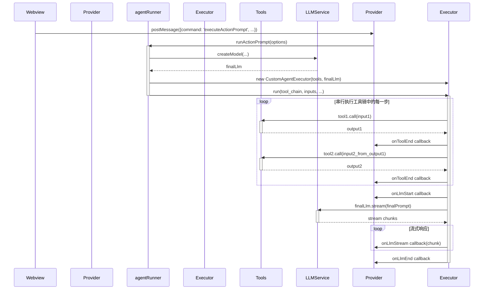
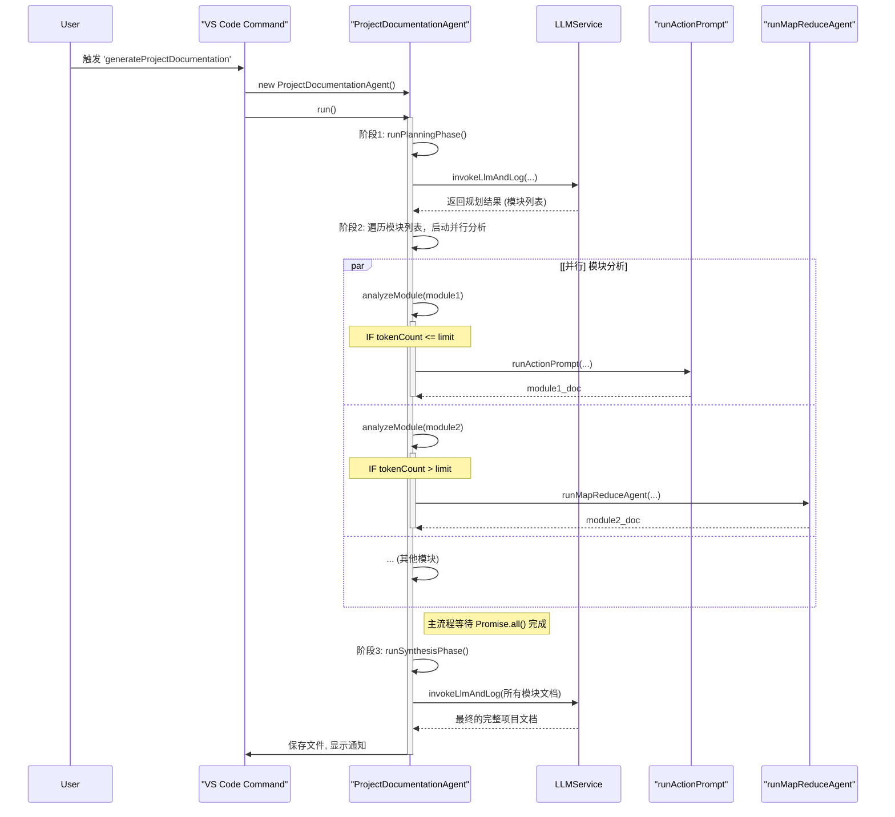

好的，根据您提供的项目代码，我将为您生成一份关于 Agent 后台执行逻辑的详细设计文档。

---

## CodeWiki Agent 后台执行逻辑设计文档

### 1. 概述 (Overview)

CodeWiki 的 Agent 系统是一个强大的后台任务执行框架，旨在自动化处理复杂的、与代码库相关的任务，例如生成项目文档、分析代码模块等。该系统被设计为可扩展、可配置的，并支持并行处理以提高效率。

其核心思想是：

1.  **声明式任务定义**: 开发者通过 YAML 文件定义任务流程（Action Prompt），而不是硬编码逻辑。
2.  **工具化能力**: 将所有对文件系统、LLM 的操作封装成可复用的、独立的“工具”（Tools）。
3.  **智能编排**: 根据任务的复杂度和规模，自动选择合适的执行策略，如简单的串行工具链或复杂的大规模并行 Map-Reduce。
4.  **分层架构**: 将用户交互、任务分发、流程编排、原子操作等逻辑清晰地分离开来。

### 2. 核心组件 (Core Components)

![组件关系图](https://mermaid.ink/svg/eyJjb2RlIjoiY2xhc3NEaWFncmFtXG4gICAg方向gVEIgXG5cbiAgICBjbGFzcyBVc2VyIHt9XG4gICAgY2xhc3MgVlNjb2RlQ29tbWFuZCB7fVxuICAgIGNsYXNzIENvZGVXaWtpVmlld1Byb3ZpZGVyIHtcbiAgICAgICsgcnVuQWN0aW9uUHJvbXB0KClcbiAgICB9XG4gICAgY2xhc3MgUHJvamVjdERvY3VtZW50YXRpb25BZ2VudCB7XG4gICAgICArIHJ1bigpXG4gICAgICAtIGFuYWx5emVNb2R1bGUoKVxuICAgIH1cbiAgICBjbGFzcyBhZ2VudFJ1bm5lciB7XG4gICAgICArIHJ1bkFjdGlvblByb3B0KClcbiAgICB9XGwgYWdlbnRPcmNoZXN0cmF0b3Ige1xuICAgICAgKyBydW5NYXBSZWR1Y2VBZ2VudCgpXG4gICAgfVxuICAgIGNsYXNzIEN1c3RvbUFnZW50RXhlY3V0b3Ige1xuICAgICAgKyBydW4oKVxuICAgIH1cbiAgICBjbGFzcyBMTFNlcnZpY2Uge1xuICAgICAgKyBjcmVhdGVNb2RlbCgpXG4gICAgICsgZ2V0Q29tcGxldGlvbigpXG4gICAgfVxuICAgIGNsYXNzIFRvb2xzIHtcbiAgICAgIDw8aW50ZXJmYWNlPj5cbiAgICAgIFN0cnVjdHVyZWRUb29sXG4gICAgfVxuICAgIGNsYXNzIEZpbGVTeXN0ZW1Ub29scyB7fVxuICAgIGNsYXNzIExMTVRvb2xzIHt9XG5cbiAgICBVc2VyIC0tPiBWU2NvZGVDb21tYW5kIDog触发命令XG4gICAgVXNlciAtLT4gQ29kZVdpa2lWaWV3UHJvdmlkZXIgOiB触发Webview交互XG5cbiAgICBWU2NvZGVDb21tYW5kIC0tPiBQcm9qZWN0RG9jdW1lbnRhdGlvbkFnZW50IDog启动高级AgentXG5cbiAgICBQcm9qZWN0RG9jdW1lbnRhdGlvbkFnZW50IC0tPiBhZ2VudFJ1bm5lciA6 调用直接分析流程XG4gICAgUHJvamVjdERvY3VtZW50YXRpb25BZ2VudCAtLT4gYWdlbnRPcmNoZXN0cmF0b3IgOi 调用Map-Reduce流程XG4gICAgUHJvamVjdERvY3VtZW50YXRpb25BZ2VudCAtLT4gTExTZXJ2aWNlIDog用于规划和综合阶段XG5cbiAgICBDb2RlV2lraVZpZXdQcm92aWRlciAtLT4gYWdlbnRSdW5uZXIgOiB触发简单AgentXG5cbiAgICBhZ2VudFJ1bm5lciAtLT4gQ3VzdG9tQWdlbnRFeGVjdXRvciA6 执行工具链XG4gICAgYWdlbnRSdW5uZXIgLT0-IExMU2VydmljZSA6 创建LLM实例XG5cbiAgICBhZ2VudE9yY2hlc3RyYXRvciAtLT4gTExTZXJ2aWNlIDog创建LLM实例XG5cbiAgICBDdXN0b21BZ2VudEV4ZWN1dG9yIC0tPiBUb29scyA6 调用工具XG4gICAgQ3VzdG9tQWdlbnRFeGVjdXRvciAtLT4gTExTZXJ2aWNlIDog调用最终LLM_ChainXG5cbiAgICBUb29scyA8fC0tIEZpbGVTeXN0ZW1Ub29sc1xuICAgIFRvb2xzIDx8LS0gTExNVG9vbHNcbiAgICBMTE1Ub29scyAtLT4gTExTZXJ2aWNlIDogLLM作为工具的一部分XG4iLCJtZXJtYWlkIjp7InRoZW1lIjoiZGVmYXVsdCJ9LCJ1cGRhdGVFZGl0b3IiOmZhbHNlLCJhdXRvU3luYyI6dHJ1ZSwidXBkYXRlRGlhZ3JhbSI6ZmFsc2V9)

*   **`LLMService`**: 统一的 LLM 接入层。它抽象了不同模型提供商（如 OpenAI、Google Gemini）的差异，并提供了一个 `createModel` 工厂方法来创建模型实例。所有 Agent 和 Tool 都通过它来获取 LLM 能力。
*   **工具 (Tools)**:
    *   **`fileSystemTools`**: 提供与文件系统交互的原子能力，如 `get_directory_tree`、`get_all_files_content` 等。这些工具被设计为 LangChain 的 `StructuredTool`，具有明确的输入/输出和描述。
    *   **`llmTools`**: 封装了“LLM-as-a-Tool”的思想。例如，`file_selector_llm_tool` 利用一个 LLM 来智能地从文件摘要中筛选出相关文件，其本身也是一个工具。
*   **执行器/编排器 (Executors/Orchestrators)**:
    *   **`CustomAgentExecutor`**: 负责执行一个**串行**的工具链 (`tool_chain`)。它按顺序调用 YAML 中定义的工具，将上一个工具的输出作为下一个工具的输入，最后将所有工具的输出整合起来，传递给最终的 LLM 进行推理。
    *   **`agentRunner`**: `CustomAgentExecutor` 的封装器，负责解析 YAML、创建 LLM 实例和回调函数，然后启动 `CustomAgentExecutor`。
    *   **`agentOrchestrator`**: 实现了**并行**的 Map-Reduce 逻辑。它接收一个大任务（如分析一个大型模块），将其分解为多个小批次（Map），并行处理这些批次，然后将结果汇总起来进行最终处理（Reduce）。
*   **高级智能体 (High-Level Agents)**:
    *   **`ProjectDocumentationAgent`**: 这是一个高级的、有状态的智能体，用于完成“生成整个项目文档”的复杂任务。它本身就是一个编排器，将任务分解为**规划、并行执行、综合**三个阶段。它会根据每个子任务（模块）的规模，动态选择使用 `runActionPrompt`（串行）还是 `runMapReduceAgent`（并行）策略。

### 3. 执行流程与图表 (Execution Flows & Diagrams)

系统主要有两种核心的后台执行流程：

1.  **单任务工具链智能体 (Tool-Chain Agent)**: 用于执行定义好的、线性的工具序列。
2.  **项目文档生成智能体 (Project Documentation Agent)**: 用于执行多阶段、并行的复杂任务。

#### 3.1. 流程一: 单任务工具链智能体 (Tool-Chain Agent)

此流程通常由 Webview 中的特定操作（如输入 `/agent` 指令）触发，执行一个定义在 YAML 中的 `tool_chain`。这是一个**串行**流程。

**时序图 (Sequence Diagram):**



#### 3.2. 流程二: 项目文档生成智能体 (Project Documentation Agent)

此流程由 VS Code 命令面板中的 `codewiki.generateProjectDocumentation` 触发，是一个复杂的多阶段、并行流程。

**高级流程图 (High-Level Flowchart):**

```mermaid
graph TD
    A[开始: 用户触发命令] --> B{创建 ProjectDocumentationAgent 实例};
    B --> C[阶段1: 规划<br>调用LLM分析项目文件树<br>输出模块列表(plan.json)];
    C --> D{阶段2: 并行执行<br>遍历每个模块};

    subgraph 并行处理
        direction LR
        D1[启动模块1分析<br>analyzeModule(m1)]
        D2[启动模块2分析<br>analyzeModule(m2)]
        D3[...]
    end
    
    D --> D1;
    D -- 1.5s延迟后 --> D2;
    D -- 1.5s延迟后 --> D3;

    D1 --> E{等待所有模块分析完成<br>Promise.all(modulePromises)};
    D2 --> E;
    D3 --> E;

    E --> F[阶段3: 综合<br>将所有模块文档喂给LLM<br>生成最终项目文档];
    F --> G[完成: 保存最终文档并通知用户];
```

**关键并行阶段时序图 (Sequence Diagram for Parallel Execution):**

这个时序图详细展示了 `ProjectDocumentationAgent` 的 `run` 方法如何编排整个流程，尤其是并行分析模块的部分。



#### 3.3. 流程三: Map-Reduce 智能体 (内部细节)

这是 `ProjectDocumentationAgent` 在处理大型模块时调用的一个子流程，由 `agentOrchestrator.ts` 中的 `runMapReduceAgent` 函数实现。

**Map-Reduce 流程图 (Flowchart):**

```mermaid
graph TD
    subgraph Map-Reduce 流程
        A[开始: runMapReduceAgent] --> B{获取模块下所有文件路径};
        B --> C{分词并计算每个文件的Token数};
        C --> D{创建文件批次<br>确保每批次总Token数不超过限制};
        D --> E{并行处理所有批次 (Map阶段)};
        
        subgraph "并行 Map"
            direction LR
            E1[批次1 -> LLM.invoke(map_prompt)]
            E2[批次2 -> LLM.invoke(map_prompt)]
            E3[...]
        end
        
        E -- 启动 --> E1
        E -- 1.5s延迟后启动 --> E2
        E -- 1.5s延迟后启动 --> E3

        E1 --> F{等待所有Map任务完成};
        E2 --> F;
        E3 --> F;

        F --> G[合并所有Map结果 (Markdown摘要)];
        G --> H{执行 Reduce 阶段<br>LLM.invoke(reduce_prompt, 合并后的摘要)};
        H --> I[生成最终文档];
        I --> J[结束: 返回最终文档];
    end
```

### 4. 总结

CodeWiki 的 Agent 后台执行逻辑是一个设计精良、分层清晰的系统。它通过将能力**工具化**、流程**声明化**，实现了高度的灵活性和可扩展性。

- **`CustomAgentExecutor`** 提供了可靠的**串行**任务执行能力。
- **`agentOrchestrator`** 和 **`ProjectDocumentationAgent`** 引入了**并行**处理机制，通过 Map-Reduce 和任务分发（带延迟启动）等策略，能够高效处理大规模、耗时的任务，显著提升了复杂 Agent 的执行效率和用户体验。
- **`LLMService`** 作为统一入口，简化了模型管理和调用，使得整个系统能够轻松地在不同的大语言模型之间切换和配置。

这种混合了串行和并行、简单执行器和高级编排器的架构，使得 CodeWiki 能够应对从简单问答到全项目文档生成的各种复杂场景。