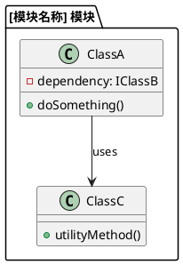
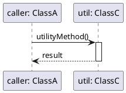
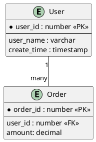
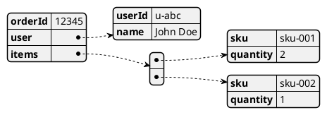
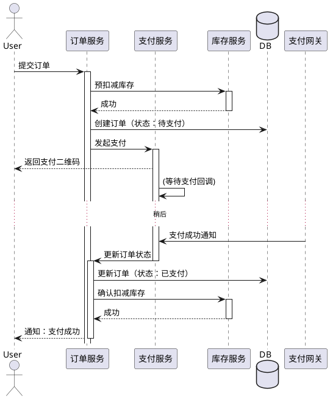

# xxx服务/组件实现设计说明书

## 1. 概述

讲清楚服务或组件在整个系统中的定位、核心职责与设计目标。它要解决什么问题，为谁提供服务，其业务价值和技术边界是什么。

## 2. 服务/组件功能清单

基于组件、服务的功能与DFX属性，明确后续关键要素设计内容与目标。

### 2.1 业务功能

*服务或组件业务功能，承载自架构设计、系统设计、功能设计拆解，对服务、组件的功能进行全量描述。*

| 功能清单 | 功能说明 |
| --- | --- |
| 创建主机 | 基于网络与规格元数据，注入配置、下载镜像、配置网络、构建主机 |
| 删除主机 | 删除主机对应的资源与主机实例 |
| ... | ... |

### 2.2 DFX非业务功能

*服务或组件的DFX非业务功能，如性能、可靠性、安全性等要求。*
1.  中心云场景下，单集群支持4000+实例生命周期管理
2.  核心创建接口99.9%的SLA，平均时延<200ms
3.  敏感数据落盘必须加密

## 3. 实现模型

本章节是设计说明书的核心，描述了服务/组件的整体实现架构，以及其内部各软件单元的详细设计。它旨在清晰地呈现代码的宏观结构与微观实现细节，作为编码阶段最主要的指导蓝图。

### 3.1 上下文视图

*描述软件实现元素上下文视图，将软件实现元素当做黑盒，描述其与外部环境、系统的关系。*
此视图帮助我们理解本服务/组件在整个系统中所处的位置，明确其边界和外部依赖的系统或服务。

### 3.2 软件分层架构

*描述服务/组件的内部逻辑分层设计。将系统分解为若干职责清晰的逻辑层，并定义层与层之间的依赖规则。*
常见的分层方式如：接口层 (API Layer)、业务逻辑层 (Business Logic Layer)、数据访问层 (Data Access Layer)、领域模型 (Domain Model)等。

### 3.3 核心模块详细设计

本节将逐一详细描述在`3.2 软件分层架构`中识别出的各个核心软件模块。每个子章节对应一个独立的模块。

---
#### **3.3.x [模块名称] 模块详细设计 (模板)**

**a. 模块职责**

简要描述本模块的核心职责、在分层架构中所处的位置及其设计目标。

**b. 静态结构设计 (类图)**

*采用类图展示本模块内部的核心类及其相互关系。*

**c. 核心类说明**

| 类/接口名 | 核心职责说明 |
| --- | --- |
| `ClassA` | 模块的核心服务类，负责... |
| `ClassC` | 提供...功能的工具类。 |

**d. 核心流程时序**

*采用时序图展示模块内对象为完成一个核心业务时的交互流程。*

**e. 模块依赖关系**

*明确列出本模块对服务内部其他模块的依赖。*

| 依赖的模块/接口 | 所在分层 | 依赖目的说明 |
| --- | --- | --- |
| `IClassB` | 数据访问层 | 依赖其接口进行数据持久化。 |
| ... | ... | ... |

---

## 4. 接口

本章详细定义本服务/组件**对外提供**的API契约，是客户端与本服务交互的唯一标准。

### 4.1 总体设计

描述接口的设计思路、风格（如RESTful、gRPC）、版本策略、鉴权方式等。

### 4.2 接口清单

#### 4.2.1 接口名：XXX
* **接口功能**：描述接口的功能。
* **接口路径/方法**：`POST /api/v1/hosts`
* **协议**：HTTP/REST
* **输入参数（Request Body/Query Params）**：
    * `param_name` (`type`, `是否必选`, `描述`, `取值范围/示例`)
* **输出参数（Response Body）**：
    * `field_name` (`type`, `描述`, `示例`)
* **返回值/状态码**：
    * 成功：`201 Created`
    * 失败：`400 Bad Request` (原因...) / `500 Internal Server Error` (原因...)
* **注意事项**：接口的使用约束、性能要求、幂等性说明等。

#### 4.2.2 ...（下一个接口）

## 5. 数据模型

本章描述服务/组件所依赖的数据实体的结构、关系和约束。

### 5.1 设计目标

根据业务特点，明确数据存储的选型目标（如关系型、NoSQL、缓存等），以及数据模型要满足的一致性、扩展性要求。

### 5.2 设计约束

确定数据模型设计的原则和要求，如：Schema约束、数据生命周期、并发访问策略、数据安全、数据迁移方案等。

### 5.3 模型实现

*采用ER图（关系型数据库）或JSON/UML对象图（NoSQL）等方式描述核心数据模型。*

**ER图参考:**

**Json模型参考:**

## 6. 交互模型

本章重点描述**跨模块、跨服务**的核心业务流程，展示为完成一个完整的端到端功能，各个主要模块/服务之间是如何进行动态交互的。它提供了比第3章中单个模块内部时序图更宏观的业务视图。

*注意：如果服务的所有核心逻辑都在单个模块内闭环，本章可省略。*

### 6.1 方案选型（可选）

若复杂的交互流程有多种实现方案（如同步调用 vs. 异步消息驱动），在此进行对比分析和决策。

### 6.2 交互模型实现

*采用UML时序图或活动图，描述一个完整的端到端业务流程。*

**“用户支付”跨服务交互示例:**
