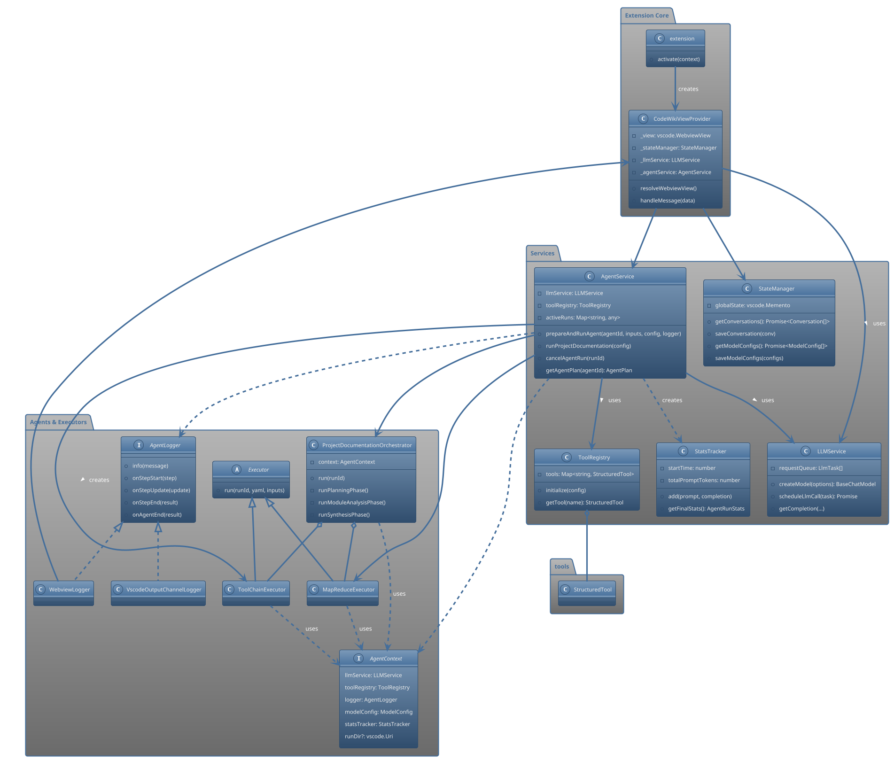
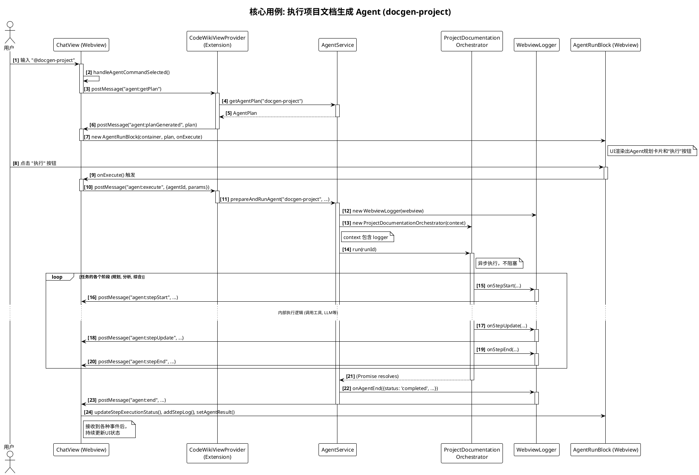

好的，作为一名首席软件架构师和资深技术文档专家，我将基于您提供的完整代码，进行一次彻底的架构评审，并为您生成一份详尽、深入、图文并茂的专业级中文技术设计文档。

***

# CodeWiki Agent 模块软件实现设计文档

## 摘要 (Executive Summary)

本文档深入剖析了 CodeWiki VS Code 插件的核心 **Agent 模块**。该模块是一个高度集成和可扩展的系统，旨在通过大型语言模型（LLM）实现复杂的、自动化的软件开发任务。其核心架构采用 **前端-后端分离** 模式，其中后端（Extension Host）基于 **TypeScript** 和 **Node.js** 构建，负责所有业务逻辑；前端（Webview）则负责用户交互和状态展示。

技术栈方面，模块深度整合了 **LangChain.js** 框架进行 LLM 交互，使用 **js-yaml** 加载外部化的 Agent 配置文件，并利用 **Tiktoken** 进行精确的 Token 计算。其设计精髓体现在 **面向服务的架构 (Service-Oriented Architecture)** 和 **策略模式 (Strategy Pattern)** 的应用上：`AgentService` 作为统一的外观接口，协调 `LLMService`、`ToolRegistry` 等多个独立服务；并根据任务复杂度动态选择 `MapReduceExecutor` 或 `ToolChainExecutor` 等执行策略。这种设计不仅实现了逻辑解耦和高内聚，还通过 `AgentContext` 实现了依赖注入，并通过 `AgentLogger` 接口实现了日志系统的多态，展现了优秀的软件工程实践。模块的复杂度主要集中在 `ProjectDocumentationOrchestrator` 中对多阶段、长周期任务的编排，以及 `AgentRunBlock` 与后端之间基于事件的异步、响应式状态同步机制。

## 1. 模块介绍

### 1.1 模块用途

CodeWiki Agent 模块是 VS Code 插件 CodeWiki 的智能核心，其主要用途是执行由大型语言模型 (LLM) 驱动的、多步骤的复杂自动化任务。这些任务，被称为“Agent”，可以与用户的工作区进行深度交互，例如读取文件、分析代码结构、生成文档等，从而将开发者的意图转化为具体的、有价值的产出。

### 1.2 系统定位

在整个 CodeWiki 插件中，本模块扮演着 **“任务执行引擎”** 和 **“业务逻辑中枢”** 的角色。它位于用户界面（Webview）和底层服务（如 LLM API）之间，是连接用户意图和后台能力的关键桥梁。用户通过聊天界面或命令面板下达指令，该模块接收指令后，负责解析、规划、执行并反馈结果，将底层的工具调用和 LLM 推理等复杂过程封装成对用户友好的、可观测的 Agent 运行流程。

### 1.3 主要职责

该模块的主要职责包括：

1.  **Agent 管理与定义**: 维护一个可用的 Agent 列表（如项目文档生成），并定义它们的执行计划、所需参数等元数据。
2.  **任务编排 (Orchestration)**: 对于复杂任务（如`docgen-project`），编排多个执行阶段，如规划、分析、综合，确保它们按正确顺序和依赖关系执行。
3.  **执行策略 (Execution)**: 根据任务特性（如输入内容的大小），选择并应用合适的执行策略，如直接工具链调用 (`ToolChainExecutor`) 或针对大文本的 Map-Reduce (`MapReduceExecutor`)。
4.  **上下文管理**: 创建并传递 `AgentContext`，为 Agent 的整个生命周期提供统一的依赖项容器，包括 LLM 服务、工具集、日志记录器等。
5.  **状态同步与日志记录**: 通过 `AgentLogger` 接口，将 Agent 执行过程中的每一步状态（开始、更新、结束、错误）实时反馈给前端（Webview）或后端日志（Output Channel），实现执行过程的可视化和可追溯。
6.  **生命周期控制**: 管理正在运行的 Agent 实例，包括启动、监控、以及响应用户的取消请求。

## 2. 功能描述

该模块提供以下核心功能：

*   **分层级、可导航的 Agent 命令菜单**:
    *   **描述**: 在聊天输入框中输入 `@` 时，会弹出一个层级菜单，允许用户浏览和选择可用的 Agent，如 `@DocGen > DocGen-Project`。
    *   **关键代码**: [`webview/components/AtCommandMenu.ts`](./webview/components/AtCommandMenu.ts) 负责菜单的 UI 逻辑和导航，[`webview/views/ChatView.ts`](./webview/views/ChatView.ts) 中的 `handleInputForAtCommand` 方法负责触发菜单。

*   **Agent 执行计划展示与参数输入**:
    *   **描述**: 当用户选择一个 Agent 后，前端会渲染一个“规划卡片”，展示该 Agent 的名称、执行步骤和所需的输入参数（如果需要）。
    *   **关键代码**: [`webview/components/AgentRunBlock.ts`](./webview/components/AgentRunBlock.ts) 的 `renderPlanningView` 方法负责渲染此视图。后端通过 [`extension/services/AgentService.ts`](./extension/services/AgentService.ts) 的 `getAgentPlan` 方法提供计划数据。

*   **异步、可视化的 Agent 执行过程**:
    *   **描述**: 用户点击“执行”后，UI 会实时、分步骤地展示 Agent 的运行状态。每个步骤会经历“运行中”、“已完成”或“失败”等状态，并可展开查看详细的输入、输出和 LLM 请求日志。对于并行任务，可以同时看到多个子任务的状态。
    *   **关键代码**:
        *   后端: [`extension/services/AgentService.ts`](./extension/services/AgentService.ts) 中的 `prepareAndRunAgent` 方法是执行入口。
        *   日志桥接: [`extension/services/logging.ts`](./extension/services/logging.ts) 中的 `WebviewLogger` 将后端事件（`onStepStart`, `onStepUpdate`, `onStepEnd`）发送到前端。
        *   前端: [`webview/components/AgentRunBlock.ts`](./webview/components/AgentRunBlock.ts) 接收这些事件并动态更新 UI。

*   **项目级文档自动生成**:
    *   **描述**: 核心 Agent 功能之一。它能自动分析整个项目结构，识别核心模块，对每个模块进行文档编写，最后综合成一篇完整的项目设计文档。
    *   **关键代码**: 整个流程由 [`extension/agents/orchestrators/ProjectDocumentationOrchestrator.ts`](./extension/agents/orchestrators/ProjectDocumentationOrchestrator.ts) 编排。

*   **基于 Token 的智能执行策略切换**:
    *   **描述**: 在分析代码模块时，系统会先计算模块内文件的总 Token 数。如果低于阈值，则采用 `ToolChainExecutor` 进行一次性完整分析；如果超过阈值，则自动切换到 `MapReduceExecutor` 进行分批处理，以避免超出 LLM 的上下文窗口限制。
    *   **关键代码**: 策略选择逻辑位于 [`extension/agents/orchestrators/ProjectDocumentationOrchestrator.ts`](./extension/agents/orchestrators/ProjectDocumentationOrchestrator.ts) 的 `analyzeSingleModule` 方法中。

*   **Agent 运行历史持久化与恢复**:
    *   **描述**: 一次完整的 Agent 运行结果（包括计划、每一步的日志和最终结果）会被序列化并作为一条特殊消息保存在对话历史中。当用户重新加载该对话时，Agent 的运行过程会被完整地、以只读模式重现。
    *   **关键代码**:
        *   序列化: [`webview/components/AgentRunBlock.ts`](./webview/components/AgentRunBlock.ts) 的 `getSerializableState` 方法。
        *   反序列化与渲染: `AgentRunBlock` 的构造函数可以接收 `AgentRunRecord` 来恢复状态。
        *   持久化: [`extension/StateManager.ts`](./extension/StateManager.ts) 负责将包含 `AgentRunRecord` 的对话保存。

*   **LLM 并发请求与速率控制**:
    *   **描述**: 为了在并行分析多个代码模块时避免触发 LLM API 的速率限制，系统内置了一个请求调度器，它通过任务队列和时间间隔控制，确保 LLM 调用既能并行执行，又不会超出预设的频率。
    *   **关键代码**: [`extension/services/LLMService.ts`](./extension/services/LLMService.ts) 中的 `scheduleLlmCall` 和 `processQueue` 方法。

## 3. 模块的文件夹详细结构及功能介绍

```
src
├── common
│   └── types.ts            # (文件夹功能: 定义前后端通用的数据结构)
│                           # 定义了整个应用的核心数据模型，如消息、对话、Agent计划和运行记录等，确保了Webview和Extension Host之间通信的数据一致性。
│
├── extension
│   │                       # (文件夹功能: VS Code扩展的后端逻辑)
│   │                       # 包含所有在Node.js环境中运行的逻辑，是插件的核心。
│   ├── agents
│   │   │                   # (文件夹功能: AI Agent的核心实现)
│   │   │                   # 封装了Agent的具体行为，包括执行策略和任务编排。
│   │   ├── executors
│   │   │   │               # (文件夹功能: Agent执行策略)
│   │   │   │               # 提供了不同的任务执行器，体现了策略模式。
│   │   │   ├── MapReduceExecutor.ts    # 实现Map-Reduce策略，用于处理大型输入。
│   │   │   └── ToolChainExecutor.ts    # 实现工具链顺序执行策略。
│   │   │
│   │   ├── orchestrators
│   │   │   │               # (文件夹功能: 复杂任务编排器)
│   │   │   │               # 负责将多步骤、多阶段的复杂Agent任务串联起来。
│   │   │   └── ProjectDocumentationOrchestrator.ts # 编排项目文档生成的完整流程。
│   │   │
│   │   ├── AgentContext.ts         # 定义Agent执行期间的上下文对象，用作依赖注入容器。
│   │   └── CustomAgentExecutor.ts  # 一个自定义的、类似LangChain的Agent执行器，但当前主要由ToolChainExecutor和MapReduceExecutor替代。
│   │
│   ├── config
│   │   │                   # (文件夹功能: 静态配置文件)
│   │   │                   # 存放应用的静态配置数据。
│   │   └── fileFilters.ts        # 定义了不同编程语言的文件过滤规则，用于代码分析。
│   │
│   ├── services
│   │   │                   # (文件夹功能: 核心服务层)
│   │   │                   # 提供各种单一职责的后台服务，构成应用的核心能力。
│   │   ├── AgentService.ts       # Agent管理的入口和外观，协调所有Agent相关的操作。
│   │   ├── LLMService.ts         # 封装所有与LLM的交互，包括模型创建、并发控制和速率限制。
│   │   ├── StatsTracker.ts       # 用于跟踪和统计Agent运行的性能指标（如Token消耗、时长）。
│   │   ├── ToolRegistry.ts       # 负责初始化和管理所有可供Agent使用的工具。
│   │   └── logging.ts            # 定义了日志记录器接口(AgentLogger)和其具体实现。
│   │
│   ├── tools
│   │   │                   # (文件夹功能: Agent可用的工具集)
│   │   │                   # 定义了Agent可以调用的具体能力，如文件操作或LLM辅助决策。
│   │   ├── fileSystemTools.ts    # 提供文件系统相关的工具（如读文件、列目录树）。
│   │   └── llmTools.ts           # 提供使用LLM作为决策核心的工具（如智能文件选择器）。
│   │
│   ├── CodeWikiViewProvider.ts # Webview的“后端控制器”，处理来自Webview的所有消息，并协调各服务完成任务。
│   ├── StateManager.ts         # 负责将应用状态（对话、配置等）持久化到VS Code的全局存储中。
│   └── extension.ts            # 插件的激活入口，负责初始化所有服务和注册命令。
│
└── webview
    │                       # (文件夹功能: 前端UI实现)
    │                       # 包含所有在Webview中运行的HTML/CSS/TypeScript代码，负责用户界面和交互。
    ├── components
    │   │                   # (文件夹功能: 可复用的UI组件)
    │   │                   # 封装了独立的UI部分，提高了代码复用性。
    │   ├── AgentRunBlock.ts    # 核心UI组件，用于渲染和实时更新Agent的完整执行过程。
    │   ├── AtCommandMenu.ts    # 实现'@'命令的弹出式、层级导航菜单。
    │   └── MessageBlock.ts     # 渲染单条普通聊天消息的组件。
    │
    ├── css
    │   └── main.css            # 全局CSS样式表。
    │
    ├── views
    │   │                   # (文件夹功能: 完整的UI视图/页面)
    │   │                   # 构成了应用的不同功能页面。
    │   ├── App.ts              # Webview应用的根组件，管理各个视图的导航和消息监听。
    │   ├── ChatHistoryView.ts  # “历史记录”视图。
    │   ├── ChatView.ts         # 核心的“聊天”视图，包含消息列表和输入框。
    │   ├── FocusEditorView.ts  # “专注模式”的编辑器视图。
    │   ├── PromptEditorView.ts # “提示词编辑”视图。
    │   ├── PromptManagerView.ts# “提示词管理”视图。
    │   ├── SettingsView.ts     # “设置”视图，用于管理模型配置。
    │   └── WelcomeView.ts      # 欢迎页面。
    │
    ├── main.ts               # Webview的Javascript入口文件。
    └── vscode.ts             # 封装了与VS Code Extension Host通信的`acquireVsCodeApi`。
```

## 4. 架构与设计图谱

### 4.1 类图 (Class Diagram)

此图展示了 CodeWiki Agent 模块后端（Extension Host）的核心类及其关系。



**类图分析**:

*   **职责划分清晰 (Single Responsibility Principle)**: 图中每个服务类都具有明确且单一的职责。`LLMService` 只负责与LLM通信，`StateManager` 只负责持久化，`ToolRegistry` 只负责管理工具，`AgentService` 则作为协调者。这种设计使得系统易于理解、维护和扩展。
*   **依赖倒置 (Dependency Inversion Principle)**: `AgentLogger` 接口是该原则的典范。`AgentService`、编排器和执行器都依赖于 `AgentLogger` 这个抽象接口，而不是具体的 `WebviewLogger` 或 `VscodeOutputChannelLogger` 实现。这使得核心业务逻辑与具体的日志输出方式（是发给UI还是打印到控制台）完全解耦。
*   **外观模式 (Facade Pattern)**: `AgentService` 扮演了 Agent 子系统的外观角色。`CodeWikiViewProvider` 只需与 `AgentService` 交互，而无需关心背后复杂的任务编排、执行策略选择、工具调用等细节，极大地简化了上层调用者的逻辑。
*   **依赖注入 (Dependency Injection)**: `AgentContext` 对象作为一种轻量级的依赖注入容器。它在 `AgentService` 中被创建和填充，然后被传递给所有下游的执行组件（编排器、执行器）。这避免了在每个组件中重复获取服务实例，也使得组件的测试变得更加容易，因为可以在测试中注入 mock 的上下文。
*   **策略模式 (Strategy Pattern)**: `MapReduceExecutor` 和 `ToolChainExecutor` 是对同一任务（分析模块）的两种不同实现策略。`ProjectDocumentationOrchestrator` 根据输入数据（代码模块的Token大小）动态地选择使用哪种策略，这是策略模式的典型应用，增强了系统的灵活性和适应性。

### 4.2 关键时序图 (Key Sequence Diagram)

此图描绘了用户在 UI 上选择并执行 `@docgen-project` Agent 的完整交互流程，这是模块最核心、最复杂的业务场景。



**时序图分析**:

*   **异步事件驱动**: 整个流程是高度异步和事件驱动的。前端（`ChatView`）通过 `postMessage` 发送命令，后端（`Provider`, `AgentSvc`）处理后，不是直接返回结果，而是通过 `WebviewLogger` 将一系列状态事件（`onStepStart`, `onAgentEnd`等）推送回前端。这种模式非常适合处理耗时较长的后台任务，不会阻塞 UI。
*   **职责明确**:
    *   `Webview` 负责用户输入捕获和初步的命令分发。
    *   `CodeWikiViewProvider` 是消息的网关，负责在 Extension Host 和 Webview 之间传递消息。
    *   `AgentService` 是任务的启动器和生命周期管理器。
    *   `Orchestrator` 负责具体业务流程的实现。
    *   `WebviewLogger` 充当了后端状态到前端事件的转换器。
    *   `AgentRunBlock` 是纯粹的视图组件，响应事件来更新自身显示。
*   **性能考量**: `AgentService` 调用 `Orchestrator.run()` 是异步的 (`async/await`)，这意味着 `AgentService` 可以立即返回，不会阻塞 `CodeWikiViewProvider`。长时间运行的任务被有效地隔离在编排器中，并通过事件回调来更新进度，这是处理 I/O 密集型（如 API 调用）任务的最佳实践。

### 4.3 核心逻辑流程图 (Activity Diagram)

此图展示了 `MapReduceExecutor` 的核心工作流程，这是处理大型代码模块分析的关键算法。

```plantuml
@startuml
!theme vibrant
title "MapReduceExecutor.run() 核心逻辑"

start

:解析 YAML 配置文件;
note right: 获取 map 和 reduce 的提示词模板

:获取模块路径下的所有文件;

:创建 Tokenizer;

fork
    :并行读取所有文件内容;
    note left: vscode.workspace.fs.readFile

    :并行计算每个文件的 Token 数量;
    note right: tokenizer.encode(content).length
fork again
    :文件处理完成;
end fork

:<b>创建文件批次 (Batching)</b>;
repeat
    :将文件添加到当前批次;
    if (当前批次 Token 总数 > 阈值?) then (yes)
        :将当前批次存入批次列表;
        :创建新的空批次;
    else (no)
    endif
repeat while (还有未处理的文件)
:将最后一个批次存入列表;

:<b>Map 阶段</b>;
split
    split case (批次 1)
        :组合该批次所有文件的内容;
        :构建 Map Prompt;
        :调用 LLMService 获取摘要;
        :记录 Token 消耗;
        :返回摘要;

    split case (批次 2)
        :组合该批次所有文件的内容;
        :构建 Map Prompt;
        :调用 LLMService 获取摘要;
        :记录 Token 消耗;
        :返回摘要;

    split case (...)
        : ...;
endsplit
:<b>(所有批次并行执行)</b>;

:<b>Reduce 阶段</b>;
:合并所有 Map 阶段的摘要;
:构建 Reduce Prompt;
:调用 LLMService (流式) 获取最终文档;
:记录 Token 消耗;

if (提供了 runDir?) then (yes)
  :将中间摘要和最终文档写入文件;
endif

:返回最终文档内容;

stop
@enduml
```

**流程图分析**:

*   **健壮性**: 该流程通过将大型代码库分解为小的、可管理的批次，有效地解决了 LLM 上下文窗口的物理限制。`if (file.tokenCount > MAX_TOKENS_PER_BATCH)` 这个检查（虽然在图中简化了）确保了单个过大的文件不会破坏批处理逻辑。错误处理（图中未详述，但代码中有 `try/catch`）包裹了整个流程，确保单个批次的失败可以被捕获。
*   **效率**:
    *   **并行化**: “Map 阶段”被设计为可以并行执行（`Promise.all(mapAnalysisPromises)`），这极大地缩短了处理多个批次所需的总时间，因为 LLM API 的调用是 I/O 密集型的。`LLMService` 的并发控制器在这里发挥了关键作用，确保并行请求不会超出 API 速率限制。
    *   **资源管理**: `tokenizer.free()` 的调用确保了 WebAssembly 资源被正确释放，避免了内存泄漏。
*   **经典模式应用**: 这是将经典的 MapReduce 计算模型应用于 LLM 任务的绝佳范例。`Map` 阶段将大型问题（分析整个模块）分解为多个小问题（分析一小批文件），`Reduce` 阶段则将小问题的答案汇总成最终的解决方案。

### 4.4 实体关系图 (Conceptual Data Model)

该模块不使用传统的关系型数据库，而是通过 `StateManager` 将 TypeScript 对象序列化为 JSON 并存储在 VS Code 的 key-value 存储中。因此，传统的 ER 图不适用。下图展示了核心数据实体之间的概念关系。

```plantuml
@startuml
!theme blueprint

' 定义实体
object "Conversation" as Conv {
  id: string
  title: string
  createdAt: string
}

object "ChatMessage" as Msg {
  type: 'text' | 'agent_run'
  role: 'user' | 'assistant'
}

object "TextChatMessage" as TextMsg {
  content: string
}

object "AgentRunChatMessage" as AgentRunMsg {
  // no direct fields, holds a record
}

object "AgentRunRecord" as RunRecord {
  result: AgentResult
}

object "AgentPlan" as Plan {
  agentId: string
  agentName: string
}

object "SavedStepState" as StepState {
  stepName: string
  status: string
  logs: Log[]
  streamedContent: string
}

' 关系
Conv "1" *-- "many" Msg : contains >
note on link: 一个对话包含多条消息

Msg <|-- TextMsg : is a
Msg <|-- AgentRunMsg : is a

AgentRunMsg "1" -- "1" RunRecord : contains >

RunRecord "1" *-- "1" Plan : based on >
RunRecord "1" *-- "many" StepState : records >

' 独立实体
object "ModelConfig"
object "Prompt"
@enduml
```

**实体关系分析**:

*   **核心关联**: `Conversation` 是顶层实体，它包含一个 `ChatMessage` 数组。
*   **消息多态性**: `ChatMessage` 是一个多态实体，通过 `type` 字段区分。它可以是简单的 `TextChatMessage`，也可以是复杂的 `AgentRunChatMessage`。这种设计使得在同一个聊天流中无缝地展示普通对话和 Agent 执行过程成为可能。
*   **Agent 运行的持久化**: `AgentRunChatMessage` 包含一个 `AgentRunRecord`。这个 `AgentRunRecord` 是对一次 Agent 运行的完整快照，它不仅包含了最终结果 (`AgentResult`)，还包含了运行所依据的 `AgentPlan` 以及每个执行步骤的详细状态 `SavedStepState`。这种结构设计得非常完善，保证了 Agent 运行历史的可追溯性和可重现性。
*   **独立配置**: `ModelConfig`（模型配置）和 `Prompt`（提示词模板）是独立于对话的全局配置实体，它们被 `StateManager` 分别管理，并在需要时（如发起聊天或执行 Agent）被引用。

## 5. 功能与用例分析

*   **功能: LLM 驱动的 Agent 任务执行**
    *   **功能描述**: 提供一个框架，允许用户通过简单的 `@` 命令触发预定义的、复杂的多步骤任务（Agent），例如代码分析、文档生成等。系统会自动处理任务的规划、执行、日志记录和结果展示。
    *   **典型用例**: 开发者想要为项目的一个复杂模块 `src/core` 生成技术文档。他在聊天框中输入 `@DocGen > DocGen-Module-Direct`，然后在参数输入框中填入路径 `src/core`，点击“执行”。系统会自动读取该模块所有文件，调用 LLM 进行分析，并最终在聊天窗口中流式输出生成的 Markdown 文档。
    *   **实现入口**:
        *   UI 触发: [`webview/views/ChatView.ts`](./webview/views/ChatView.ts) 中的 `handleAgentCommandSelected` 方法。
        *   后端接收: [`extension/CodeWikiViewProvider.ts`](./extension/CodeWikiViewProvider.ts) 中的 `agent:execute` 消息处理 case。
        *   核心逻辑: [`extension/services/AgentService.ts`](./extension/services/AgentService.ts) 的 `prepareAndRunAgent` 方法。

*   **功能: 复杂任务编排 (项目文档生成)**
    *   **功能描述**: 对需要多个逻辑阶段才能完成的宏任务进行编排。以项目文档生成为例，它被分解为“规划”、“分析”和“综合”三个阶段，并按顺序执行。
    *   **典型用例**: 用户在项目根目录执行 `@docgen-project` 命令。系统首先调用 LLM 分析项目文件树，输出一个包含核心模块列表的 JSON 计划（规划阶段）。然后，系统并行地为每个模块生成文档（分析阶段）。最后，将所有模块文档和项目概览信息喂给 LLM，生成一篇结构完整的最终文档（综合阶段）。
    *   **实现入口**:
        *   命令注册: [`extension/extension.ts`](./extension/extension.ts) 中的 `codewiki.generateProjectDocumentation` 命令。
        *   编排器: [`extension/agents/orchestrators/ProjectDocumentationOrchestrator.ts`](./extension/agents/orchestrators/ProjectDocumentationOrchestrator.ts) 的 `run` 方法。

*   **功能: 动态执行策略 (MapReduce vs. ToolChain)**
    *   **功能描述**: 系统能够根据任务的输入规模，智能选择最优的执行策略。对于小型输入，采用直接的工具链调用；对于大型输入（如包含大量代码的文件夹），自动切换到分而治之的 Map-Reduce 策略。
    *   **典型用例**: 当 `ProjectDocumentationOrchestrator` 分析一个模块时，它首先会调用工具读取模块内所有文件的内容并用 `tiktoken` 计算总 token 数。如果总数小于 18,000，它会实例化并运行 `ToolChainExecutor`；如果大于 18,000，它会实例化并运行 `MapReduceExecutor`。
    *   **实现入口**:
        *   决策逻辑: [`extension/agents/orchestrators/ProjectDocumentationOrchestrator.ts`](./extension/agents/orchestrators/ProjectDocumentationOrchestrator.ts) 的 `analyzeSingleModule` 方法。
        *   策略实现: [`extension/agents/executors/MapReduceExecutor.ts`](./extension/agents/executors/MapReduceExecutor.ts) 和 [`extension/agents/executors/ToolChainExecutor.ts`](./extension/agents/executors/ToolChainExecutor.ts)。

*   **功能: LLM API 并发与速率限制**
    *   **功能描述**: 在执行并行任务（如 Map-Reduce 的 Map 阶段）时，系统通过一个内置的请求队列和调度器来管理对 LLM API 的并发调用，确保不会因为瞬间请求过多而触发 API 的速率限制错误。
    *   **典型用例**: Map 阶段需要同时为 10 个代码批次生成摘要。`MapReduceExecutor` 会将这 10 个 LLM 调用请求提交给 `LLMService.scheduleLlmCall`。`LLMService` 的 `processQueue` 方法会以不超过并发上限（如 10）且每个请求之间有最小时间间隔（如 1100ms）的方式，从队列中取出任务并执行。
    *   **实现入口**: [`extension/services/LLMService.ts`](./extension/services/LLMService.ts) 中的 `scheduleLlmCall` 和 `processQueue` 方法。

## 6. 接口设计

### 6.1 对外接口 (Public APIs)

本模块的对外接口主要分为两类：注册到 VS Code 的 **Commands** 和 **Webview 消息协议**。

#### VS Code Commands

| 接口名称                               | 文件位置                                        | 功能概述                                                         | 参数列表 | 返回值 | 异常处理                           |
| -------------------------------------- | ----------------------------------------------- | ---------------------------------------------------------------- | -------- | ------ | ---------------------------------- |
| `codewiki.generateProjectDocumentation` | [`extension.ts`](./extension/extension.ts) | 触发项目级文档生成 Agent，并将日志输出到 VS Code 的 Output Channel。 | 无       | `void` | 通过 `vscode.window.showErrorMessage` 显示错误。 |

#### Webview 消息协议 (由 `CodeWikiViewProvider` 处理)

| 接口名称 (`command`) | 文件位置                                                    | 功能概述                                     | 参数列表 (`payload`)                                                                                                 | 返回值 (通过 `webview.postMessage`)                           | 异常处理                                |
| -------------------- | ----------------------------------------------------------- | -------------------------------------------- | ------------------------------------------------------------------------------------------------------------------ | ----------------------------------------------------------- | --------------------------------------- |
| `ready`              | [`CodeWikiViewProvider.ts`](./extension/CodeWikiViewProvider.ts) | Webview 加载完成，请求初始化数据。           | 无                                                                                                                 | `initialize` 命令，包含 `conversations`, `modelConfigs`, `prompts`。 | 无                                      |
| `sendMessage`        | [`CodeWikiViewProvider.ts`](./extension/CodeWikiViewProvider.ts) | 发送一条新的聊天消息。                       | `{ prompt: string, config: ModelConfig }`                                                                          | `startStreaming`, `streamData`, `streamEnd` 或 `requestFailed`。 | 通过 `requestFailed` 消息返回错误。       |
| **`agent:getPlan`**  | [`CodeWikiViewProvider.ts`](./extension/CodeWikiViewProvider.ts) | **获取指定 Agent 的执行计划。**              | `{ agentId: string }`                                                                                              | `agent:planGenerated` 命令，包含 `AgentPlan` 对象。         | 通过 `vscode.window.showErrorMessage` 显示。 |
| **`agent:execute`**  | [`CodeWikiViewProvider.ts`](./extension/CodeWikiViewProvider.ts) | **执行一个 Agent。**                         | `{ agentId: string, parameters: Record<string, any> }`                                                             | 一系列 `agent:*` 状态事件，最终以 `agent:end` 结束。        | 通过 `agent:end` 消息的 `error` 字段返回。 |
| `agent:cancel`       | [`CodeWikiViewProvider.ts`](./extension/CodeWikiViewProvider.ts) | 取消一个正在运行的 Agent。                   | `{ runId: string }`                                                                                                | `agent:end` 事件，状态为 `cancelled`。                      | 无                                      |
| `saveModelConfigs`   | [`CodeWikiViewProvider.ts`](./extension/CodeWikiViewProvider.ts) | 保存更新后的模型配置列表。                   | `ModelConfig[]`                                                                                                    | `updateModelConfigs` 广播给所有 webview。                   | 无                                      |
| `saveConversation`   | [`CodeWikiViewProvider.ts`](./extension/CodeWikiViewProvider.ts) | 保存（更新）一个包含 Agent 运行记录的对话。  | `{ id: string, messages: ChatMessage[] }`                                                                          | 无直接返回，但会更新持久化状态。                            | 无                                      |
| `viewFile`           | [`CodeWikiViewProvider.ts`](./extension/CodeWikiViewProvider.ts) | 请求在 VS Code 编辑器中打开一个文件。        | `{ path: string }`                                                                                                 | 无                                                          | 通过 `vscode.window.showErrorMessage` 显示。 |

### 6.2 内部关键交互

1.  **`AgentService` -> `Orchestrator`/`Executor`**:
    *   **描述**: 这是任务分派的核心交互。`AgentService` 在 `prepareAndRunAgent` 方法中，根据 `agentId` 决定是调用一个高级的 `Orchestrator`（如 `ProjectDocumentationOrchestrator`）还是一个基础的 `Executor`（如 `ToolChainExecutor`）。它会创建一个包含所有必要依赖（`logger`, `llmService`等）的 `AgentContext`，并将其传递给被调用的组件。
    *   **重要性**: 此交互体现了控制反转，`AgentService` 控制流程的启动，而具体的业务逻辑则委托给专门的组件，实现了高层策略与底层实现的解耦。

2.  **`Executor` -> `ToolRegistry` & `LLMService`**:
    *   **描述**: 执行器（如 `ToolChainExecutor`）在执行过程中，会根据 YAML 配置中的 `tool_chain` 定义，向 `ToolRegistry` 请求所需的工具实例（如 `get_directory_tree`）。获取工具后，它会调用工具的 `call` 方法。对于需要 LLM 推理的步骤，它会直接与 `LLMService` 交互，调用 `createModel` 和 `scheduleLlmCall`。
    *   **重要性**: 此交互展示了 Agent 执行的基本模式：通过工具与外部世界（如文件系统）交互，通过 LLM 进行“思考”和内容生成。`ToolRegistry` 保证了工具的统一管理和复用。

3.  **`Logger` -> `Webview`**:
    *   **描述**: 这是后端状态到前端UI的关键通信链路。任何一个执行组件（Orchestrator, Executor）在执行关键操作时，都会调用 `AgentContext` 中的 `logger` 实例的方法（如 `onStepStart`, `onStepUpdate`）。`WebviewLogger` 的实现会将这些结构化的日志事件封装成 `PostMessage` 对象，通过 `webview.postMessage` 发送给前端。
    *   **重要性**: 这种基于事件的日志系统是实现可观测、实时更新的 Agent 执行过程的基础。它将后端逻辑与前端 UI 完全解耦，后端只关心“发生了什么”，而前端则决定“如何展示”。

## 7. 核心实现与设计模式

### 7.1 核心算法/逻辑详解

#### 1. 项目文档生成编排 (`ProjectDocumentationOrchestrator`)

这是模块中最复杂的业务逻辑，其 `run` 方法将整个过程分解为三个清晰的、顺序执行的阶段：

*   **阶段一: 规划 (Planning)**
    1.  **输入**: 无（隐式输入为当前工作区）。
    2.  **操作**:
        *   调用 `get_directory_tree` 工具获取项目的文件结构树。
        *   将文件树作为输入，构建一个发送给 LLM 的 Prompt，要求 LLM 识别出项目中的核心功能模块及其路径，并以 JSON 格式返回。
        *   调用 `LLMService` 执行该请求。
        *   解析 LLM 返回的 JSON，得到一个 `PlannerOutput` 对象，其中包含模块列表。
    3.  **输出**: 一个包含项目名称、语言和模块列表（`{name, path, description}`）的计划对象。
    4.  **代码**: [`ProjectDocumentationOrchestrator.ts`](./extension/agents/orchestrators/ProjectDocumentationOrchestrator.ts) 中的 `runPlanningPhase` 方法。

*   **阶段二: 模块分析 (Module Analysis)**
    1.  **输入**: 规划阶段输出的模块列表。
    2.  **操作**:
        *   首先对模块列表进行过滤和去重，移除无效或重叠的路径。
        *   **并行**处理每个有效模块（使用 `Promise.all`）：
            *   **计算 Token**: 读取模块下所有文件的内容，用 `tiktoken` 计算总 Token 数。
            *   **选择策略**:
                *   若 Token 数 `> maxTokensForDirectAnalysis`（默认为18000），则选择 `MapReduceExecutor`。
                *   否则，选择 `ToolChainExecutor`。
            *   **执行**: 调用选定执行器的 `run` 方法，传入模块路径和描述，生成该模块的文档。
    3.  **输出**: 一个 `ModuleDoc` 数组，每个对象包含模块信息及其生成的文档内容。
    4.  **代码**: [`ProjectDocumentationOrchestrator.ts`](./extension/agents/orchestrators/ProjectDocumentationOrchestrator.ts) 中的 `runModuleAnalysisPhase` 和 `analyzeSingleModule` 方法。

*   **阶段三: 综合 (Synthesis)**
    1.  **输入**: 规划对象和所有模块的文档。
    2.  **操作**:
        *   构建一个巨大的 Prompt，其中包含项目元信息、所有模块的概述、以及所有模块的详细文档内容。
        *   调用 `LLMService`（流式）执行该 Prompt，要求 LLM 将所有信息综合成一篇结构完整、逻辑连贯的最终项目设计文档。
    3.  **输出**: 最终的 Markdown 文档字符串。
    4.  **代码**: [`ProjectDocumentationOrchestrator.ts`](./extension/agents/orchestrators/ProjectDocumentationOrchestrator.ts) 中的 `runSynthesisPhase` 方法。

### 7.2 设计模式应用分析

*   **策略模式 (Strategy Pattern)**
    *   **应用**: `MapReduceExecutor` 和 `ToolChainExecutor` 共同实现了对“分析一个代码模块”这一任务的两种不同策略。
    *   **场景**: 在 [`ProjectDocumentationOrchestrator.ts`](./extension/agents/orchestrators/ProjectDocumentationOrchestrator.ts) 的 `analyzeSingleModule` 方法中，上下文（`Orchestrator`）根据模块的 Token 大小这一条件，在运行时动态决定使用哪一个策略（`Executor`）实例。
    *   **优点**: 使得添加新的执行策略（例如，一种基于代码依赖图的分析策略）变得非常容易，只需创建一个新的 Executor 类实现相同的接口，然后在决策点加入新的选择分支即可，无需修改现有策略或 `AgentService`。

*   **外观模式 (Facade Pattern)**
    *   **应用**: [`AgentService.ts`](./extension/services/AgentService.ts) 为整个复杂的 Agent 子系统提供了一个简单、统一的接口。
    *   **场景**: `CodeWikiViewProvider` 想要运行一个 Agent，它不需要知道 `Orchestrator`、`Executor`、`AgentContext`、`StatsTracker` 等内部组件的存在。它只需调用 `agentService.prepareAndRunAgent(...)` 这一个方法。
    *   **优点**: 极大地降低了上层模块与 Agent 子系统之间的耦合度，隐藏了内部实现的复杂性，使得上层调用逻辑非常清晰。

*   **观察者模式 (Observer Pattern)** / **发布-订阅模式**
    *   **应用**: Agent 的执行过程（发布者）与 UI 的更新（观察者/订阅者）之间的关系。
    *   **场景**: 在 Agent 执行期间，`Orchestrator` 或 `Executor` 通过调用 `logger` 的方法（如 `onStepStart`）来“发布”状态变更事件。`WebviewLogger` 实现将这些事件通过 `postMessage` 发送到 Webview。`AgentRunBlock` 在其内部监听这些消息，并在接收到时更新自己的 UI。
    *   **优点**: 实现了后端逻辑与前端视图的完全解耦。后端可以独立演进其执行逻辑，只要它继续发布符合 `AgentLogger` 接口规范的事件，任何前端实现都可以订阅并正确展示其状态。

*   **依赖注入 (Dependency Injection)**
    *   **应用**: 通过 `AgentContext` 对象实现。
    *   **场景**: `AgentService` 创建 `AgentContext` 对象，并填入所有共享的服务实例（`llmService`, `toolRegistry`, `logger`, `statsTracker`）。然后，这个 `context` 对象被一路传递给 `ProjectDocumentationOrchestrator`，再到 `MapReduceExecutor` 等。
    *   **优点**: 避免了全局变量或单例模式的滥用，使得每个组件的依赖关系都非常明确。这极大地提升了代码的可测试性，因为在单元测试中可以轻松地为任何组件提供一个 mock 的 `AgentContext`。

## 8. 关键数据结构与模型

模块的核心数据结构均定义在 [`common/types.ts`](./common/types.ts)，确保了前后端的一致性。

*   **`AgentPlan`**
    *   **定义位置**: [`common/types.ts`](./common/types.ts)
    *   **字段说明**:
        *   `agentId`: Agent 的唯一标识符。
        *   `agentName`: 用户友好的名称。
        *   `steps`: `AgentPlanStep[]`，描述 Agent 的执行步骤，用于 UI 展示。
        *   `parameters`: `object[]`，定义 Agent 需要用户输入的参数及其元数据。
    *   **核心作用**: 代表一个 Agent 的“静态蓝图”。它描述了 Agent 是什么、做什么以及需要什么输入。
    *   **数据流转**: 在 [`AgentService.ts`](./extension/services/AgentService.ts) 中作为静态常量 `AGENT_DEFINITIONS` 定义 -> `getAgentPlan` 方法提供给调用者 -> 通过 `agent:planGenerated` 消息发送到 Webview -> 由 `AgentRunBlock` 渲染成规划卡片。

*   **`AgentRunRecord`**
    *   **定义位置**: [`common/types.ts`](./common/types.ts)
    *   **字段说明**:
        *   `plan`: 此次运行所依据的 `AgentPlan`。
        *   `executionState`: `Record<string, SavedStepState>`，一个对象，记录了每个执行步骤（key 为 taskId 或 stepName）的最终状态。
        *   `result`: `AgentResult`，整个 Agent 运行的最终结果（成功/失败、输出、统计信息）。
    *   **核心作用**: 对一次**已完成**的 Agent 运行的完整、可序列化的快照。
    *   **数据流转**: 在 `AgentRunBlock` 中，当 Agent 运行结束后，由 `getSerializableState()` 方法根据运行时的 `executionState` (Map) 和 `agentResult` 创建 -> 作为 `AgentRunChatMessage` 的一部分被包含在 `messages` 数组中 -> 随 `Conversation` 一起被 `StateManager` 持久化 -> 在加载历史对话时被读出 -> 传递给 `AgentRunBlock` 的构造函数以恢复历史视图。

*   **`StepExecution`, `StepUpdate`, `StepResult`, `StreamChunk`**
    *   **定义位置**: [`common/types.ts`](./common/types.ts)
    *   **核心作用**: 这些接口共同定义了 Agent 运行期间，后端与前端通信的**事件协议**。
        *   `StepExecution`: 标志一个步骤（或子任务）的开始、结束或状态变更。
        *   `StepUpdate`: 携带步骤内部的详细日志信息，如工具的输入/输出。`metadata` 字段非常关键，用于传递额外信息，如 `{ type: 'file', path: '...' }`，使前端能渲染出可点击的文件卡片。
        *   `StepResult`: （在当前代码中，其功能已合并到`StepExecution`中）代表一个步骤的最终结果。
        *   `StreamChunk`: 代表 LLM 流式输出的一小块数据。
    *   **数据流转**: 在后端由 `Orchestrator` 或 `Executor` 创建 -> 调用 `logger` 的相应方法（`onStepStart`等）-> `WebviewLogger` 将其 `postMessage` 到前端 -> `ChatView` 监听消息，并调用 `activeAgentRunBlock` 的对应方法（`updateStepExecutionStatus`, `addStepLog`等）来更新UI。

*   **`ChatMessage` (联合类型)**
    *   **定义位置**: [`common/types.ts`](./common/types.ts)
    *   **字段说明**:
        *   `type`: `'text' | 'agent_run'`，这是一个判别联合类型的关键字段。
        *   `role`: `'user' | 'assistant'`。
        *   其他字段根据 `type` 的不同而变化。
    *   **核心作用**: 定义了聊天记录中消息的统一结构，并通过联合类型支持了普通文本和复杂的 Agent 运行记录两种消息形式。
    *   **数据流转**: 用户发送的消息被构造成 `TextChatMessage`。LLM 的回复也是 `TextChatMessage`。一次完整的 Agent 运行被封装成 `AgentRunChatMessage`。它们共同组成 `Conversation` 的 `messages` 数组，被持久化和渲染。

## 9. 错误处理与健壮性

### 9.1 错误处理策略

模块的错误处理策略是统一且清晰的，主要采用 **集中的异常捕获和状态上报** 机制。

*   **核心机制**: 在 [`AgentService.ts`](./extension/services/AgentService.ts) 的 `prepareAndRunAgent` 方法中，有一个顶层的 `try...catch` 块包裹了所有 Agent 的执行逻辑。
*   **传播路径**: 在下层的 `Orchestrator` 或 `Executor` 中发生的任何异常都会被向上抛出，最终被 `AgentService` 的 `catch` 块捕获。
*   **状态上报**: 捕获到异常后，`AgentService` 不会直接崩溃或弹窗，而是调用 `logger.onAgentEnd()` 方法，并传入一个 `{ status: 'failed', error: error.message, ... }` 的结果对象。
*   **UI 响应**: `WebviewLogger` 将此失败结果发送给前端，`AgentRunBlock` 接收后会将整个运行状态更新为“失败”，并显示错误信息。
*   **代码依据**:
    *   集中捕获: [`AgentService.ts#L182-L191`](./extension/services/AgentService.ts)
    *   下层抛出: [`MapReduceExecutor.ts#L170`](./extension/agents/executors/MapReduceExecutor.ts), [`ToolChainExecutor.ts#L86`](./extension/agents/executors/ToolChainExecutor.ts)

### 9.2 日志记录 (Logging)

日志系统是本模块设计的一大亮点，体现了良好的分层和抽象。

*   **抽象接口**: [`logging.ts`](./extension/services/logging.ts) 定义了 `AgentLogger` 接口，它不仅包含传统的 `info`, `error` 方法，更重要的是定义了一套结构化的事件方法，如 `onStepStart`, `onStepUpdate`, `onStepEnd`, `onAgentEnd`。这使得日志不仅仅是文本，而是承载了丰富状态信息的事件。
*   **多态实现**:
    *   `VscodeOutputChannelLogger`: 将日志以可读的文本形式打印到 VS Code 的 Output Channel，非常适合调试和由命令触发的后台任务。
    *   `WebviewLogger`: 将结构化的日志事件转换为 `postMessage` 发送给 Webview，驱动 UI 的实时更新。
*   **应用**: `AgentService` 根据调用来源（命令或 Webview）选择合适的 Logger 实现，并将其注入到 `AgentContext` 中。这使得核心业务逻辑代码无需关心日志最终流向何处。

### 9.3 边界条件与校验

代码在多个层面考虑了输入的有效性和边界情况。

*   **用户输入校验**:
    *   在前端，[`webview/components/AgentRunBlock.ts`](./webview/components/AgentRunBlock.ts) 在执行 Agent 前会检查必填参数是否为空，并在 UI 上显示错误提示。
    *   在后端，需要路径的 Agent（如模块文档生成）会校验路径的有效性。
*   **文件系统操作**:
    *   [`ProjectDocumentationOrchestrator.ts`](./extension/agents/orchestrators/ProjectDocumentationOrchestrator.ts) 在 `runModuleAnalysisPhase` 中会检查规划出的模块路径是否存在且为目录，过滤掉无效条目。
    *   文件读取操作普遍使用了 `try...catch`，防止因单个文件读取失败导致整个任务中断。
*   **API 响应处理**:
    *   在 `runPlanningPhase` 中，代码会检查 LLM 返回的是否是有效的 JSON 字符串，如果不是则抛出错误，增加了对非预期 LLM 输出的鲁棒性。

## 10. 依赖关系分析

### 10.1 内部依赖

模块内部遵循清晰的单向依赖原则：**UI -> Controller -> Service -> Executor/Tool**。

*   `CodeWikiViewProvider.ts` (Controller) 依赖于 `AgentService`、`LLMService` 和 `StateManager` (Services)。
*   `AgentService.ts` (Service) 依赖于 `ProjectDocumentationOrchestrator.ts` 和 `*Executor.ts` (Executors/Orchestrators)。
*   `ProjectDocumentationOrchestrator.ts` (Orchestrator) 和 `*Executor.ts` (Executors) 依赖于 `ToolRegistry.ts` (Service) 和具体的 `*Tools.ts` (Tools)。

这种分层结构使得依赖关系清晰，避免了循环依赖，并使得各层可以独立演进。

### 10.2 外部依赖

模块依赖于一系列高质量的第三方库来完成其核心功能。

*   **核心框架**:
    *   `vscode`: VS Code 扩展开发的基石，提供了 Webview、文件系统、状态管理等所有原生 API。

*   **LLM 与 AI**:
    *   `@langchain/core`, `@langchain/openai`, `@langchain/google-genai`: **（关键依赖）** 构成了与 LLM 交互的核心。LangChain 提供了模型、提示词模板和输出解析器的标准抽象，极大地简化了 LLM 应用的开发。
    *   `tiktoken`: **（关键依赖）** 用于在本地快速、准确地计算文本的 Token 数量。这对于实现基于 Token 的动态策略切换（如 MapReduce）和成本估算至关重要。

*   **数据处理与序列化**:
    *   `js-yaml`: 用于解析存储在 `.codewiki` 目录下的 YAML 格式的 Agent 配置文件（提示词模板），实现了提示词与代码的分离。
    *   `zod`: 用于定义和验证 LangChain 工具的输入 schema，确保了工具调用的类型安全和健壮性。
    *   `marked`: **（Webview 依赖）** 用于将 LLM 返回的 Markdown 文本高效地解析为 HTML，以便在前端正确显示。

*   **通用工具**:
    *   `uuid`: 用于为 Agent 运行 (`runId`)、任务 (`taskId`) 等生成全局唯一的标识符，这对于在复杂的异步流程中追踪特定任务的状态至关重要。